# Rekomendasi Struktur & Kerangka Laporan Proyek Besar
**Judul:** Sistem E-Ticketing Bus Online Berbasis Website Menggunakan Metode Agile Development
**Pembagian Bab:** BAB III (Analisis & Perancangan), BAB IV (Implementasi & Pengujian), dan BAB V (Penutup)

---

## BAB III: ANALISIS DAN PERANCANGAN SISTEM

#### 3.1. Analisis Kebutuhan Sistem
Analisis kebutuhan sistem merupakan tahap krusial dalam siklus hidup pengembangan perangkat lunak (*software development life cycle*) untuk memahami, mendefinisikan, dan mendokumentasikan kapabilitas serta batasan sistem yang akan dibangun. Melalui analisis kebutuhan, pengembang dapat menyelaraskan tujuan bisnis Perusahaan Otobus (PO) dengan kebutuhan teknis penumpang dan petugas operasional di lapangan. Kebutuhan sistem ini dipetakan secara mendalam untuk meminimalkan ambiguitas dan mendeteksi kesalahan perancangan sejak dini. Analisis kebutuhan sistem pada pengembangan aplikasi E-Ticketing Bus Online ini dibagi menjadi dua kategori utama, yaitu kebutuhan fungsional (*functional requirements*) yang mendefinisikan apa yang harus dilakukan oleh sistem, dan kebutuhan non-fungsional (*non-functional requirements*) yang mendefinisikan karakteristik operasional atau batasan kualitas sistem.

#### 3.1.1. Kebutuhan Fungsional (*Functional Requirements*)
Kebutuhan fungsional menggambarkan interaksi perilaku sistem, proses input-output, serta fungsi komputasi spesifik yang disediakan oleh aplikasi untuk memenuhi kebutuhan setiap pengguna. Sistem E-Ticketing ini dirancang dengan arsitektur hak akses multi-aktor yang terbagi menjadi tiga peran pengguna (*user roles*): Penumpang (*Customer*), Petugas Lapangan (*Officer*), dan Administrator (*Admin*). Detail deskripsi kebutuhan fungsional untuk masing-masing aktor dijabarkan sebagai berikut:

1. **Penumpang (Customer):**
   * **Sistem Pendaftaran dan Autentikasi Akun:** Penumpang dapat mendaftarkan akun baru dengan menginputkan nama lengkap, alamat email unik, nomor telepon, dan kata sandi. Penumpang dapat masuk ke dalam sistem menggunakan email dan kata sandi yang telah terdaftar guna mengakses fitur reservasi tiket.
   * **Fitur Pencarian Jadwal Keberangkatan:** Penumpang dapat mencari jadwal bus secara dinamis dengan menginputkan kota asal keberangkatan, kota tujuan perjalanan, dan tanggal keberangkatan yang diinginkan. Sistem kemudian menyajikan data relevan berupa nama bus, tipe kelas bus, jam keberangkatan, estimasi jam tiba di tujuan, harga per kursi, serta sisa ketersediaan kursi.
   * **Visualisasi Peta Kursi Interaktif (*Interactive Seat Map*):** Saat memilih jadwal bus, penumpang disajikan peta denah kursi secara visual (layout 2x2). Sistem secara *real-time* membedakan status kursi yang telah dipesan oleh orang lain (ditandai dengan warna abu-abu/silang) dan kursi yang masih tersedia untuk dipilih (ditandai dengan ikon kursi aktif). Penumpang dapat memilih satu atau beberapa kursi sekaligus dalam satu kali transaksi keberangkatan.
   * **Pengisian Data Manifest Penumpang:** Setelah memilih kursi, penumpang diwajibkan menginputkan nama identitas penumpang untuk masing-masing nomor kursi yang dipilih guna keperluan pencatatan manifest resmi PO Bus.
   * **Penerapan Kode Promosi (*Promo Code*):** Penumpang dapat menginputkan kode kupon promosi yang aktif. Sistem memvalidasi masa berlaku, batas kuota penggunaan, dan secara otomatis memotong total biaya pemesanan berdasarkan tipe diskon (persentase atau nominal tetap).
   * **Integrasi Pembayaran Daring (*Payment Gateway*):** Sistem terintegrasi dengan Midtrans API. Penumpang dapat membayar tagihan pemesanan tiket menggunakan berbagai metode pembayaran digital seperti transfer bank (Virtual Account), e-Wallet (QRIS), atau gerai ritel. Konfirmasi status pembayaran diproses secara otomatis oleh sistem melalui mekanisme *webhook callback* tanpa perlu verifikasi manual.
   * **Penerbitan E-Tiket PDF dan QR Code:** Setelah pembayaran terkonfirmasi lunas (*paid*), sistem secara otomatis menerbitkan tiket elektronik (E-Ticket) resmi yang dapat diunduh oleh penumpang dalam format PDF. E-tiket ini dilengkapi dengan *QR Code* unik yang merepresentasikan kode booking untuk digunakan sebagai *boarding pass*.
   * **Fitur Ulasan Perjalanan (*Review & Feedback*):** Penumpang yang telah menyelesaikan perjalanan dapat memberikan rating (1-5 bintang) dan ulasan tertulis mengenai pelayanan armada bus yang ditumpangi melalui dashboard customer.
   
2. **Petugas Terminal (Officer):**
   * **Sistem Autentikasi Petugas:** Petugas dapat melakukan login khusus ke dalam portal petugas menggunakan email dan password terdaftar.
   * **Modul Pemindaian Boarding (*Webcam QR Scanner*):** Petugas dapat mengaktifkan kamera perangkat (smartphone/laptop) secara langsung melalui peramban web untuk memindai *QR Code* e-ticket penumpang saat berada di pintu masuk terminal/bus.
   * **Validasi Status Tiket Real-time:** Setelah pemindaian dilakukan, sistem memproses kode tiket secara instan untuk memeriksa keaktifan tiket, kecocokan jadwal hari tersebut, dan status pelunasan pembayaran di database.
   * **Konfirmasi Boarding Keberangkatan:** Petugas dapat melakukan konfirmasi status penumpang menjadi "Sudah Masuk Bus" (*boarded*) melalui satu klik. Sistem secara otomatis memperbarui status tiket di database beserta pencatatan waktu tepatnya boarding.
   * **Histori Pemindaian Manifest:** Di bawah menu scanner, petugas disajikan tabel histori boarding real-time untuk memantau manifest penumpang yang sudah masuk bus pada jadwal keberangkatan tersebut beserta informasi siapa nama petugas yang melakukan scan.
   
3. **Administrator PO Bus (Admin):**
   * **Manajemen Data Master Armada Bus:** Admin memiliki wewenang penuh untuk menambah, mengubah, atau menghapus data armada bus yang mencakup nama bus, tipe kelas bus (misal: Eksekutif, Ekonomi, Super Executive), dan jumlah kapasitas total kursi bus.
   * **Manajemen Rute Perjalanan:** Admin mengelola rute trayek perjalanan bus yang mencakup nama terminal kota asal, terminal kota tujuan, serta estimasi jarak/durasi waktu tempuh perjalanan.
   * **Manajemen Jadwal Keberangkatan:** Admin mengelola jadwal operasional bus dengan merelasikan armada bus dengan rute trayek, menetapkan harga tiket per kursi, serta menentukan jam keberangkatan dan jam kedatangan secara spesifik.
   * **Manajemen Kupon Promo:** Admin dapat mengonfigurasi kupon promo aktif, menentukan kode unik promo, nilai diskon, limit kuota penggunaan maksimum, serta tanggal masa aktif promosi.
   * **Monitoring Transaksi & Keuangan:** Admin dapat memantau seluruh transaksi pemesanan tiket masuk, melihat detail data penumpang, mencetak manifes perjalanan per jadwal, dan mengekspor laporan keuangan penjualan tiket harian/bulanan.
   * **Analisis Analitik Okupansi AI (*Gemini AI Occupancy Prediction*):** Admin disajikan analitik prediksi okupansi bus untuk 7 hari ke depan. Fitur ini diintegrasikan dengan model bahasa Gemini AI yang menganalisis data kapasitas historis pemesanan untuk menghasilkan prediksi persentase tingkat keterisian kursi.
   * **Analisis Sentimen Ulasan AI (*Gemini AI Sentiment Classifier*):** Admin dapat memantau sentimen ulasan penumpang yang masuk. Sistem secara otomatis menggunakan Gemini AI untuk mengklasifikasikan komentar tertulis ulasan menjadi kategori *positive*, *neutral*, atau *negative* untuk mempermudah evaluasi kualitas layanan supir dan armada.

#### 3.1.2. Kebutuhan Non-Fungsional (*Non-Functional Requirements*)
Kebutuhan non-fungsional menetapkan kriteria kualitas operasional, aspek keamanan, performa, dan keandalan sistem agar sistem tidak hanya berfungsi dengan benar, melainkan juga berjalan secara optimal dan aman. Detail kebutuhan non-fungsional pada sistem e-ticketing dijabarkan di bawah ini:

1. **Keandalan dan Konsistensi Data (*Reliability & ACID Compliance*):** Sistem wajib menangani kondisi persaingan akses (*concurrency / race condition*) pada pemilihan kursi. Apabila dua pengguna melakukan checkout untuk nomor kursi yang sama secara bersamaan, sistem harus menggunakan transaksi database relasional (*MySQL Database Transaction*) secara ketat. Proses transaksi akan menjamin bahwa data kursi hanya dikunci oleh satu transaksi yang diselesaikan terlebih dahulu, sementara transaksi kedua akan di-rollback secara aman untuk mencegah terjadinya kursi ganda (*double-booking*).
2. **Keamanan Sistem (*Security Requirements*):** 
   * **Keamanan Data Kredensial:** Kata sandi seluruh pengguna (Penumpang, Petugas, Admin) wajib diamankan menggunakan algoritma enkripsi satu arah *BCrypt* melalui fungsi bawaan PHP `password_hash()` untuk mencegah kebocoran data jika database diretas.
   * **Keamanan Akses Halaman (*Filter Autentikasi*):** Route dashboard admin dan scanner petugas dilindungi oleh `AuthFilter` dan `RoleFilter`. Sistem wajib memeriksa keaktifan session token pengguna di server secara dinamis pada setiap request. Jika user mencoba mengakses halaman admin tanpa hak akses yang sesuai, sistem akan langsung mengarahkan kembali ke halaman login.
   * **Validasi Integritas Sesi:** Sistem secara dinamis memverifikasi apakah `user_id` yang tersemat dalam session cookie masih terdaftar sebagai data aktif di database. Jika data user dihapus (misal akibat database reset), sistem secara otomatis menghancurkan session stale tersebut dan mengarahkan paksa ke halaman login untuk mencegah error database akibat query berelasi.
3. **Ketersediaan dan Performa (*Availability & Performance*):**
   * Sistem e-ticketing harus memiliki tingkat ketersediaan (*uptime*) yang tinggi agar penumpang dapat melakukan pemesanan tiket kapan saja.
   * Proses rendering visual peta kursi dan pengecekan kupon promo via AJAX Request harus memiliki waktu respon (*latency*) di bawah 2 detik guna memberikan pengalaman pengguna yang responsif.
4. **Usability & Responsibilitas Antarmuka:**
   * Desain antarmuka pengguna dikembangkan secara responsif (*responsive web design*) menggunakan stylesheet yang adaptif terhadap berbagai resolusi layar perangkat (smartphone, tablet, laptop, dan desktop PC).
   * Peta kursi harus diatur agar mudah diklik menggunakan perangkat sentuh (*touchscreen*) pada ponsel pintar tanpa terjadi salah klik nomor kursi.
5. **Integrasi Portabilitas API:**
   * Modul pembayaran sistem harus dapat berkomunikasi secara aman dengan server Midtrans Sandbox menggunakan protokol HTTPS.
   * Modul kecerdasan buatan harus terhubung secara stabil dengan API Google Gemini AI menggunakan API Key yang aman dari paparan publik.

---

### 3.2. Metode Pengembangan Sistem (Agile Scrum)
Metode pengembangan sistem yang diterapkan dalam proyek pembangunan aplikasi *E-Ticketing Bus Online* ini adalah **Agile Development** dengan menggunakan kerangka kerja **Scrum**. Pemilihan metode Agile didasarkan pada karakteristik pengembangan perangkat lunak modern yang dinamis, di mana kebutuhan pengguna (*user requirements*) dan fungsionalitas sistem seringkali mengalami penyesuaian seiring dengan evaluasi berkelanjutan. Agile berfokus pada kolaborasi yang intensif, adaptabilitas terhadap perubahan, dan penyampaian produk kerja secara inkremental (bertahap). 

Di dalam kerangka kerja Scrum, proses pengembangan dipecah menjadi siklus kerja kecil yang disebut **Sprint**. Setiap Sprint memiliki durasi yang tetap (dalam proyek ini ditetapkan 1 minggu per siklus) dan bertujuan menghasilkan produk yang fungsional (*working software*). Tim Scrum terdiri atas tiga peran utama:
1. **Product Owner:** Bertanggung jawab mendefinisikan visi produk, menyusun daftar fitur prioritas (*Product Backlog*), serta memastikan nilai bisnis dari perangkat lunak yang dikembangkan dapat tercapai dengan baik.
2. **Scrum Master:** Bertindak sebagai fasilitator yang menjaga agar proses pengembangan tetap mematuhi prinsip-prinsip Scrum, menyingkirkan hambatan (*impediments*) yang dihadapi oleh tim pengembang, serta memastikan komunikasi berjalan lancar.
3. **Development Team (Tim Pengembang):** Tim lintas fungsi yang berkolaborasi untuk merancang, melakukan pengodean (*coding*), mengintegrasikan API, melakukan migrasi database, dan menguji sistem hingga siap dirilis.

Alur pengerjaan dengan Scrum diilustrasikan melalui siklus yang dimulai dari penyusunan *Product Backlog*, diikuti dengan *Sprint Planning* untuk menentukan target pekerjaan di setiap siklus, *Daily Scrum* (pertemuan harian singkat untuk koordinasi), dan diakhiri dengan *Sprint Review* serta *Sprint Retrospective* untuk melakukan evaluasi dan perbaikan proses pada iterasi berikutnya.

#### 3.2.1. Product Backlog & User Stories
*Product Backlog* merupakan daftar utama yang memuat seluruh kebutuhan fungsional, fitur, perbaikan bug, dan aspek teknis sistem yang dikumpulkan sejak fase inisiasi proyek. Backlog ini didefinisikan secara spesifik menggunakan format *User Story* untuk mempermudah pemahaman dari sudut pandang pengguna akhir beserta *Acceptance Criteria* (Kriteria Penerimaan) masing-masing:

1. **US-01: Registrasi Akun & Autentikasi Penumpang**
   * **Peran (Aktor):** Penumpang (*Customer*)
   * **User Story:** Sebagai calon penumpang, saya ingin mendaftarkan akun dan login ke website, agar saya memiliki profil pemesanan pribadi dan dapat melacak riwayat tiket saya.
   * **Kriteria Penerimaan (*Acceptance Criteria*):**
     * Halaman register memiliki validasi alamat email unik dan minimal panjang password.
     * Kata sandi (password) dienkripsi menggunakan hashing BCrypt di database demi keamanan.
     * Pengguna diarahkan secara otomatis ke dashboard customer setelah berhasil login.

2. **US-02: Pencarian Jadwal Keberangkatan Bus**
   * **Peran (Aktor):** Penumpang (*Customer*)
   * **User Story:** Sebagai calon penumpang, saya ingin mencari jadwal bus berdasarkan asal, tujuan, dan tanggal keberangkatan, agar saya dapat mengetahui ketersediaan armada yang sesuai kebutuhan.
   * **Kriteria Penerimaan (*Acceptance Criteria*):**
     * Sistem menampilkan daftar jadwal bus yang aktif beserta tipe kelas bus, harga tiket, jam berangkat/tiba, dan sisa kursi.
     * Sistem memblokir pencarian tiket atau menyembunyikan jadwal bus jika waktu keberangkatan telah terlewati.

3. **US-03: Pemilihan Nomor Kursi Interaktif**
   * **Peran (Aktor):** Penumpang (*Customer*)
   * **User Story:** Sebagai calon penumpang, saya ingin memilih nomor kursi secara visual di denah bus, agar saya mendapatkan posisi duduk yang nyaman dan terhindar dari pemesanan ganda.
   * **Kriteria Penerimaan (*Acceptance Criteria*):**
     * Halaman denah kursi menampilkan visualisasi tata letak layout bus secara dinamis (layout 2x2).
     * Kursi yang telah dipesan orang lain berubah warna (abu-abu/silang) dan tidak dapat dipilih kembali.
     * Sistem memproteksi transaksi di tingkat database agar tidak terjadi *double-booking* dari transaksi konkuren.

4. **US-04: Transaksi Pembayaran Online Otomatis**
   * **Peran (Aktor):** Penumpang (*Customer*)
   * **User Story:** Sebagai calon penumpang, saya ingin membayar tiket secara online menggunakan payment gateway, agar transaksi instan dan saya langsung menerima e-tiket digital.
   * **Kriteria Penerimaan (*Acceptance Criteria*):**
     * Sistem terintegrasi dengan Snap Midtrans API.
     * Mendukung pembayaran otomatis via transfer bank (Virtual Account) dan e-Wallet (QRIS).
     * Status transaksi diperbarui secara otomatis menggunakan API webhook callback.

5. **US-05: Validasi Boarding Pass QR Code**
   * **Peran (Aktor):** Petugas Lapangan (*Officer*)
   * **User Story:** Sebagai petugas terminal, saya ingin memindai QR Code tiket penumpang melalui web-scanner, agar proses check-in boarding cepat dan bebas antrean.
   * **Kriteria Penerimaan (*Acceptance Criteria*):**
     * Petugas dapat memindai QR Code tiket menggunakan kamera browser secara langsung.
     * Sistem memproses manifes real-time untuk mengecek kevalidan tiket dan mencatat status boarding.
     * Halaman scanner menampilkan histori manifest boarding per jadwal beserta nama petugas pemeriksa.

6. **US-06: Analitik Prediksi Okupansi AI**
   * **Peran (Aktor):** Administrator (*Admin*)
   * **User Story:** Sebagai pengelola PO Bus, saya ingin melihat prediksi okupansi perjalanan bus 7 hari ke depan menggunakan AI, agar saya dapat mengoptimalkan jadwal operasional armada.
   * **Kriteria Penerimaan (*Acceptance Criteria*):**
     * Sistem menghubungkan riwayat data pemesanan historis ke model kecerdasan buatan (Gemini AI).
     * Dashboard admin menampilkan presentase angka prediksi keterisian bus beserta analisis penjelasannya.

7. **US-07: Klasifikasi Sentimen Ulasan AI**
   * **Peran (Aktor):** Administrator (*Admin*)
   * **User Story:** Sebagai pengelola PO Bus, saya ingin memantau analisis sentimen ulasan penumpang berbasis AI, agar saya dapat mengevaluasi kinerja supir dan kru bus secara objektif.
   * **Kriteria Penerimaan (*Acceptance Criteria*):**
     * Sistem secara otomatis mengklasifikasikan komentar review penumpang menggunakan Gemini AI.
     * Mengelompokkan sentimen ulasan ke dalam kategori *positive*, *neutral*, atau *negative* di halaman admin.

#### 3.2.2. Pembagian dan Pelaksanaan Sprint
Pelaksanaan pengembangan sistem e-ticketing bus dibagi ke dalam 4 (empat) siklus *Sprint* dengan rincian pengerjaan teknis sebagai berikut:

1. **Sprint 1: Fondasi Sistem & Manajemen Data Master (Durasi: 1 Minggu)**
   * **Tujuan:** Membangun arsitektur dasar perangkat lunak dan manajemen data awal PO Bus.
   * **Aktivitas Teknis:** 
     * Perancangan skema database MySQL dan inisialisasi framework CodeIgniter 4.
     * Implementasi migrasi database (`app/Database/Migrations/`) untuk tabel `users`, `buses`, `routes`, dan `schedules`.
     * Pembangunan sistem registrasi akun, enkripsi password, login multi-role (Admin, Petugas, Customer), dan sistem logout.
     * Pembuatan modul dashboard admin untuk mengelola (CRUD) data armada bus, trayek rute, dan jadwal operasional bus.
   * **Hasil:** Aplikasi dasar yang dapat mengelola data master bus, rute, jadwal, dan menangani autentikasi.

2. **Sprint 2: Alur Pemesanan & Visualisasi Denah Kursi (Durasi: 1 Minggu)**
   * **Tujuan:** Membangun modul reservasi tiket mandiri bagi customer.
   * **Aktivitas Teknis:**
     * Pengembangan modul pencarian tiket bus dengan filter asal, tujuan, dan tanggal keberangkatan yang dinamis.
     * Pembuatan visual denah kursi (*seat map* 2x2) interaktif menggunakan layout CSS/JS yang terhubung dengan sisa kapasitas kursi di database.
     * Implementasi form manifest pengisian data nama penumpang untuk setiap nomor kursi.
     * Pengodean logika pengamanan pemesanan di database transaction (`$db->transStart()`) untuk menghindari *race condition* atau pemesanan ganda pada kursi yang sama.
   * **Hasil:** Penumpang dapat mencari jadwal bus, memilih kursi kosong, mengisi manifest, dan membuat reservasi booking.

3. **Sprint 3: Payment Gateway Sandbox & QR Code Boarding (Durasi: 1 Minggu)**
   * **Tujuan:** Mengintegrasikan gerbang pembayaran digital dan sistem validasi boarding.
   * **Aktivitas Teknis:**
     * Integrasi SDK Snap Midtrans API pada alur checkout pemesanan tiket.
     * Pembuatan route API callback (`PaymentWebhook.php`) untuk mendeteksi perubahan status pembayaran secara asinkron dari server Midtrans.
     * Penerbitan e-tiket PDF dinamis menggunakan library Dompdf lengkap dengan *QR Code* unik setelah transaksi lunas.
     * Pengembangan modul *Webcam QR Code Boarding Scanner* bagi petugas untuk memvalidasi tiket masuk dan memperbarui status boarding manifest penumpang.
   * **Hasil:** Pembayaran tiket berjalan otomatis secara online dan petugas lapangan dapat memindai QR Code tiket penumpang untuk boarding.

4. **Sprint 4: Analitik AI, Review Penumpang, & Laporan Admin (Durasi: 1 Minggu)**
   * **Tujuan:** Mengintegrasikan kecerdasan buatan (Gemini AI) untuk fitur analitik dan menyelesaikan modul pelaporan.
   * **Aktivitas Teknis:**
     * Pembuatan menu ulasan perjalanan bagi penumpang yang telah menyelesaikan boarding.
     * Integrasi pustaka Gemini AI Client (`app/Libraries/GeminiClient.php`) untuk memproses klasifikasi sentimen ulasan secara otomatis menjadi *positive*, *neutral*, atau *negative*.
* Perancangan dashboard statistik admin yang menampilkan grafik pendapatan keuangan total, statistik sentimen ulasan, dan manifes penumpang.
   * **Hasil:** Dashboard admin yang kaya fitur analitik AI, pengelompokan ulasan otomatis, dan visualisasi laporan keuangan.

---

#### 3.3. Pemodelan Sistem (UML Diagram)
Pemodelan sistem merupakan tahapan visualisasi arsitektur dan aliran logika perangkat lunak sebelum masuk ke tahap implementasi kode program. Rekayasa perangkat lunak pada proyek *E-Ticketing Bus Online* ini dimodelkan menggunakan **Unified Modeling Language (UML)**. UML digunakan sebagai bahasa standar visualisasi untuk mendokumentasikan spesifikasi sistem dari sudut pandang pemodelan berorientasi objek (*object-oriented modeling*). Diagram UML yang digunakan dalam perancangan ini meliputi *Use Case Diagram* untuk memetakan batasan sistem dan interaksi aktor, *Use Case Description* untuk mendetailkan skenario langkah demi langkah, *Activity Diagram* untuk menggambarkan alur aktivitas proses bisnis, *Sequence Diagram* untuk mendokumentasikan pertukaran pesan antar-objek secara kronologis, dan *Class Diagram* untuk merancang struktur data serta relasi kelas pada aplikasi.

#### 3.3.1. Use Case Diagram
*Use Case Diagram* digunakan untuk menggambarkan fungsionalitas sistem yang diharapkan dari sudut pandang pengguna eksternal (*actor*). Diagram ini memetakan hubungan antara aktor penumpang (*Customer*), petugas lapangan (*Officer*), dan pengelola sistem (*Admin*) terhadap modul-modul sistem e-ticketing. Hubungan asosiasi (*association*) digambarkan untuk menunjukkan fungsionalitas mana saja yang dapat diakses oleh masing-masing aktor di bawah batasan sistem (*system boundary*).

*(Tempatkan Gambar Use Case Diagram di bawah paragraf ini)*

---

##### Kode Script Pembuat Diagram Use Case

Anda dapat menggunakan salah satu dari script berikut untuk digenerate langsung menjadi file gambar diagram yang rapi:

###### Opsi A: Menggunakan Script PlantUML (Sangat Direkomendasikan untuk Skripsi/UAS)
**Tempat Konversi:** Salin kode di bawah ini lalu tempel di situs **[PlantText (planttext.com)](https://www.planttext.com/)** atau **[PlantUML Online Server (www.plantuml.com/plantuml)](http://www.plantuml.com/plantuml)** untuk mengunduh versi PNG/SVG secara gratis.

```plantuml
@startuml
skinparam packageStyle rectangle
skinparam actorStyle awesome

actor "Penumpang (Customer)" as customer
actor "Petugas (Officer)" as officer
actor "Administrator (Admin)" as admin

rectangle "Sistem E-Ticketing Bus Online" {
    usecase "Registrasi Akun" as UC_Register
    usecase "Login & Autentikasi" as UC_Login
    usecase "Cari Jadwal Keberangkatan" as UC_Search
    usecase "Pilih Kursi & Input Manifest" as UC_SelectSeat
    usecase "Terapkan Kode Promo" as UC_Promo
    usecase "Lakukan Pembayaran Tiket" as UC_Payment
    usecase "Unduh E-Tiket PDF" as UC_DownloadTicket
    usecase "Chatbot Konsultasi AI" as UC_Chatbot
    usecase "Berikan Rating & Ulasan" as UC_Review
    
    usecase "Scan QR Code Boarding" as UC_ScanQR
    usecase "Konfirmasi Boarding Penumpang" as UC_ConfirmBoarding
    usecase "Lihat Histori Boarding" as UC_BoardingHistory
    
    usecase "Kelola Data Master Bus" as UC_ManageBus
    usecase "Kelola Trayek Rute" as UC_ManageRoute
    usecase "Kelola Jadwal Keberangkatan" as UC_ManageSchedule
    usecase "Kelola Kupon Promo" as UC_ManagePromo
    usecase "Lihat Laporan Finansial & Transaksi" as UC_Report
    usecase "Lihat Prediksi Okupansi AI" as UC_PredictAI
    usecase "Lihat Analisis Sentimen Ulasan AI" as UC_SentimentAI
}

actor "Midtrans Payment Gateway" as midtrans
actor "Google Gemini AI" as gemini

' Relasi Customer
customer --> UC_Register
customer --> UC_Login
customer --> UC_Search
customer --> UC_SelectSeat
customer --> UC_Promo
customer --> UC_Payment
customer --> UC_DownloadTicket
customer --> UC_Chatbot
customer --> UC_Review

' Relasi Officer
officer --> UC_Login
officer --> UC_ScanQR
officer --> UC_ConfirmBoarding
officer --> UC_BoardingHistory

' Relasi Admin
admin --> UC_Login
admin --> UC_ManageBus
admin --> UC_ManageRoute
admin --> UC_ManageSchedule
admin --> UC_ManagePromo
admin --> UC_Report
admin --> UC_PredictAI
admin --> UC_SentimentAI

' Relasi dengan Sistem Eksternal
UC_Payment --> midtrans : Konfirmasi Webhook
UC_Chatbot --> gemini : API Rekomendasi
UC_PredictAI --> gemini : API Prediksi Okupansi
UC_SentimentAI --> gemini : API Analisis Sentimen

@endum
```

###### Opsi B: Menggunakan Script Mermaid.js (Alternatif)
**Tempat Konversi:** Salin kode di bawah ini lalu tempel di situs **[Mermaid Live Editor (mermaid.live)](https://mermaid.live/)** untuk melihat pratinjau instan dan mengunduh filenya.

```mermaid
graph TD
    %% Aktor Utama
    Customer((Penumpang <br> Customer))
    Officer((Petugas <br> Officer))
    Admin((Administrator <br> Admin))

    %% Aktor Eksternal
    Midtrans((Midtrans <br> Payment))
    Gemini((Gemini AI))

    subgraph Sistem E-Ticketing Bus Online
        UC1(Registrasi Akun)
        UC2(Login & Autentikasi)
        UC3(Cari Jadwal Keberangkatan)
        UC4(Pilih Kursi & Input Manifest)
        UC5(Terapkan Kode Promo)
        UC6(Lakukan Pembayaran Tiket)
        UC7(Unduh E-Tiket PDF)
        UC8(Chatbot Konsultasi AI)
        UC9(Berikan Rating & Ulasan)
        
        UC10(Scan QR Code Boarding)
        UC11(Konfirmasi Boarding Penumpang)
        UC12(Lihat Histori Boarding)
        
        UC13(Kelola Data Master Bus)
        UC14(Kelola Trayek Rute)
        UC15(Kelola Jadwal Keberangkatan)
        UC16(Kelola Kupon Promo)
        UC17(Lihat Laporan Finansial & Transaksi)
        UC18(Lihat Prediksi Okupansi AI)
        UC19(Lihat Analisis Sentimen Ulasan AI)
    end

    %% Hubungan Aktor dengan Use Case
    Customer --> UC1
    Customer --> UC2
    Customer --> UC3
    Customer --> UC4
    Customer --> UC5
    Customer --> UC6
    Customer --> UC7
    Customer --> UC8
    Customer --> UC9

    Officer --> UC2
    Officer --> UC10
    Officer --> UC11
    Officer --> UC12

    Admin --> UC2
    Admin --> UC13
    Admin --> UC14
    Admin --> UC15
    Admin --> UC16
    Admin --> UC17
    Admin --> UC18
    Admin --> UC19

    %% Hubungan dengan Sistem Eksternal
    UC6 -.-> Midtrans
    UC8 -.-> Gemini
    UC18 -.-> Gemini
    UC19 -.-> Gemini
```

---

#### 3.3.2. Deskripsi Skenario Use Case
Deskripsi skenario use case menjabarkan secara tekstual dan runtut alur kejadian normal (*basic flow*) serta alur alternatif (*alternative flow*) dari fungsi-fungsi penting di dalam sistem. Berikut adalah deskripsi skenario untuk empat use case inti:

1. **Use Case: Autentikasi Pengguna (Login)**
   * **Aktor Utama:** Penumpang, Petugas, Admin
   * **Deskripsi:** Pengguna memasukkan alamat email dan kata sandi untuk memverifikasi identitas mereka dan masuk ke dalam sistem dengan hak akses yang sesuai.
   * **Kondisi Awal (*Pre-condition*):** Pengguna telah memiliki akun terdaftar dan berada di halaman login.
   * **Alur Kejadian Normal:**
     1. Pengguna memasukkan alamat email dan kata sandi pada formulir login.
     2. Pengguna mengklik tombol "Masuk ke Akun".
     3. Sistem memvalidasi format input dan mencocokkan kredensial dengan database.
     4. Sistem memeriksa peran (*role*) pengguna (Admin / Petugas / Customer).
     5. Sistem membuat sesi (*session*) login aktif di server.
     6. Sistem mengalihkan pengguna ke halaman dashboard yang sesuai dengan perannya.
   * **Alur Alternatif:**
     * *Langkah 3a:* Jika email atau kata sandi tidak cocok di database, sistem menampilkan pesan kesalahan "Email atau Password salah" dan mempertahankan input email pengguna pada form.
   * **Kondisi Akhir:** Pengguna berhasil diarahkan ke dashboard masing-masing role dan session login tersimpan aman.

2. **Use Case: Pemesanan Tiket & Pilih Kursi**
   * **Aktor Utama:** Penumpang (*Customer*)
   * **Deskripsi:** Penumpang memilih jadwal keberangkatan, menentukan kursi bus yang diinginkan, menginputkan nama penumpang, dan membuat pesanan tiket.
   * **Kondisi Awal (*Pre-condition*):** Penumpang telah login dan berada di halaman beranda.
   * **Alur Kejadian Normal:**
     1. Penumpang mengakses menu "Cari Tiket" dan menginputkan asal, tujuan, serta tanggal keberangkatan.
     2. Sistem menampilkan daftar jadwal bus yang sesuai.
     3. Penumpang memilih salah satu jadwal bus dan diarahkan ke halaman denah kursi (*seat map*).
     4. Penumpang memilih nomor kursi kosong (ditandai warna biru) dan menginputkan nama penumpang.
     5. Penumpang mengklik tombol "Proses Ke Pembayaran".
     6. Sistem memulai transaksi database, memvalidasi ketersediaan kursi di server untuk menghindari pemesanan ganda.
     7. Sistem mengunci nomor kursi pilihan dan menginsert data ke tabel `bookings` dan `booking_seats`.
     8. Sistem mengembalikan ID booking baru dan mengalihkan penumpang ke halaman pembayaran.
   * **Alur Alternatif:**
     * *Langkah 6a:* Jika kursi yang dipilih telah terpesan oleh transaksi lain tepat sebelum tombol dipencet, sistem melakukan rollback transaksi database, membatalkan booking, dan mengembalikan penumpang ke halaman pemilihan kursi dengan pesan peringatan.
   * **Kondisi Akhir:** Data booking terbuat dengan status `pending` dan kursi terkunci sementara.

3. **Use Case: Transaksi Pembayaran**
   * **Aktor Utama:** Penumpang (*Customer*), Sistem Payment Gateway (Midtrans)
   * **Deskripsi:** Penumpang menyelesaikan pembayaran tagihan tiket secara digital dan sistem otomatis menerbitkan tiket resmi setelah konfirmasi lunas.
   * **Kondisi Awal (*Pre-condition*):** Penumpang berada di halaman detail pembayaran dengan status booking `pending`.
   * **Alur Kejadian Normal:**
     1. Penumpang mengklik tombol pembayaran untuk menampilkan pop-up Snap Midtrans.
     2. Penumpang memilih metode pembayaran (Virtual Account / QRIS) dan melakukan pembayaran di aplikasi bank/e-wallet mereka.
     3. Server Midtrans memproses pembayaran dan mengirimkan data notifikasi JSON secara asinkron ke endpoint webhook API sistem (`api/payment/webhook`).
     4. Controller Webhook menangkap data, memvalidasi tanda tangan enkripsi (*signature key*) untuk menjamin keaslian data dari Midtrans.
     5. Sistem memperbarui status pembayaran di database menjadi `paid`.
     6. Sistem secara otomatis menerbitkan data e-tiket baru di tabel `tickets` dengan status `active` dan membangkitkan QR Code unik.
     7. Penumpang dialihkan ke halaman sukses dan dapat mengunduh tiket PDF.
   * **Alur Alternatif:**
     * *Langkah 4a:* Jika notifikasi menyatakan pembayaran kedaluwarsa atau gagal, sistem memperbarui status transaksi menjadi `failed` dan membatalkan pesanan.
   * **Kondisi Akhir:** Status pembayaran menjadi `paid`, status booking `active`, dan tiket penumpang berhasil diterbitkan.

4. **Use Case: Validasi Boarding Pass**
   * **Aktor Utama:** Petugas Lapangan (*Officer*), Penumpang (*Customer*)
   * **Deskripsi:** Petugas memindai QR Code tiket penumpang untuk memverifikasi keabsahan manifes dan mencatat status boarding masuk bus.
   * **Kondisi Awal (*Pre-condition*):** Petugas telah login dan membuka halaman Scanner di terminal keberangkatan.
   * **Alur Kejadian Normal:**
     1. Penumpang menunjukkan QR Code tiket di smartphone atau lembaran PDF.
     2. Petugas mengarahkan QR Code tersebut ke kamera scanner aktif di web browser.
     3. Sistem membaca token QR Code dan mengirimkan request verifikasi ke database.
     4. Sistem mencocokkan data manifest penumpang, status pelunasan tiket, dan jadwal bus hari tersebut.
     5. Sistem menampilkan informasi penumpang (Nama, Asal, Tujuan, Nomor Kursi, Bus) dengan status "Valid".
     6. Petugas mengklik tombol "Konfirmasi Boarding".
     7. Sistem memperbarui status tiket menjadi `boarded`, mencatat waktu scan (`scanned_at`), dan menyimpan ID petugas pemeriksa (`scanned_by`).
     8. Sistem memperbarui tabel histori boarding di bagian bawah halaman scanner secara real-time.
   * **Alur Alternatif:**
     * *Langkah 4a:* Jika QR Code tidak terdaftar, sudah pernah digunakan boarding, atau status pembayaran belum lunas, sistem menampilkan notifikasi kesalahan berwarna merah beserta alasannya.
   * **Kondisi Akhir:** Status tiket berubah menjadi `boarded` dan tercatat dalam manifes keberangkatan bus secara permanen.

#### 3.3.3. Diagram Aktivitas (*Activity Diagram*)
Diagram aktivitas menggambarkan aspek dinamis dari sistem berupa visualisasi alur kerja aktivitas bisnis secara berurutan. Pada perancangan sistem e-ticketing ini, terdapat 3 diagram aktivitas utama:

##### 1. Activity Diagram Pemesanan & Pemilihan Kursi
Alur ini menggambarkan aktivitas penumpang mulai dari mencari jadwal perjalanan, memilih kursi secara interaktif, hingga data reservasi terkunci di database.

###### Script PlantUML (Konversi di [planttext.com](https://www.planttext.com/)):
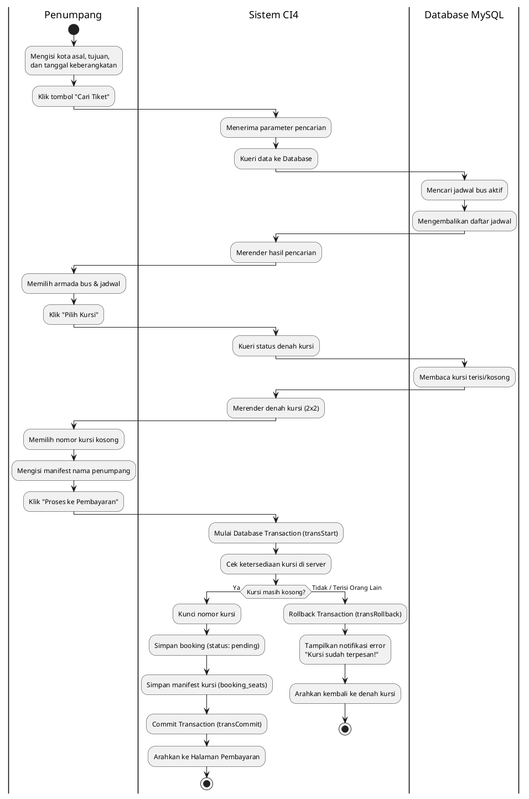

###### Script Mermaid.js (Konversi di [mermaid.live](https://mermaid.live/)):
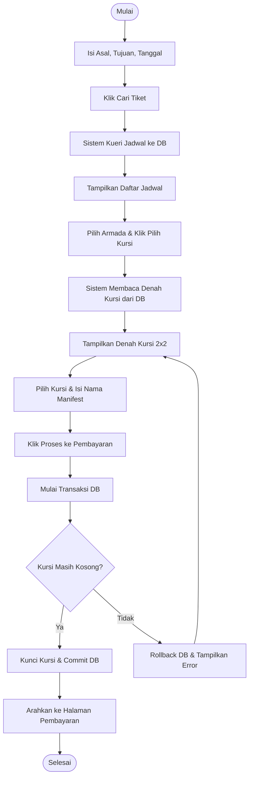

---

##### 2. Activity Diagram Webhook Callback Midtrans
Alur ini mendokumentasikan proses di belakang layar saat gerbang pembayaran Midtrans mengirimkan notifikasi asinkron untuk memperbarui status transaksi secara otomatis dan menerbitkan tiket.

###### Script PlantUML (Konversi di [planttext.com](https://www.planttext.com/)):
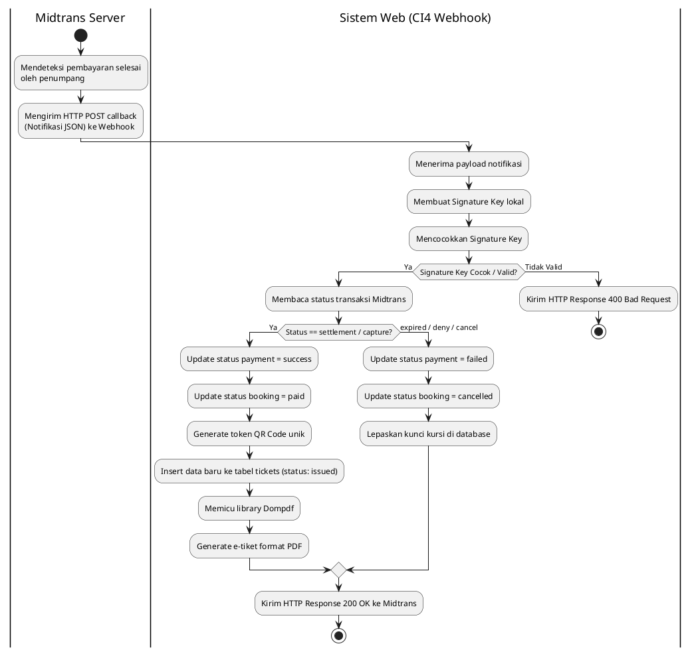

###### Script Mermaid.js (Konversi di [mermaid.live](https://mermaid.live/)):
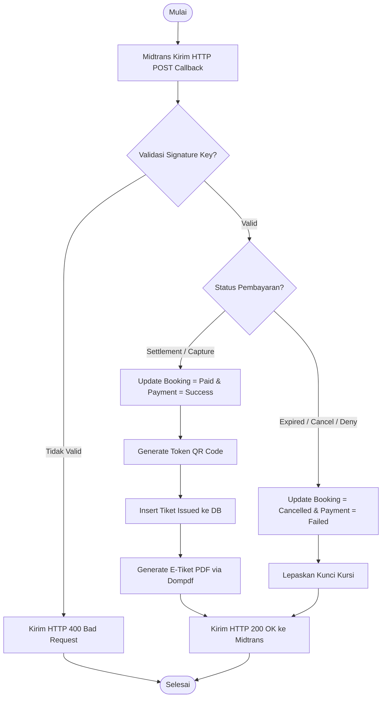

---

##### 3. Activity Diagram Scan Boarding Petugas
Alur ini memodelkan aktivitas petugas terminal yang memindai QR Code pada e-tiket penumpang untuk melakukan *check-in* manifes keberangkatan bus secara *real-time*.

###### Script PlantUML (Konversi di [planttext.com](https://www.planttext.com/)):
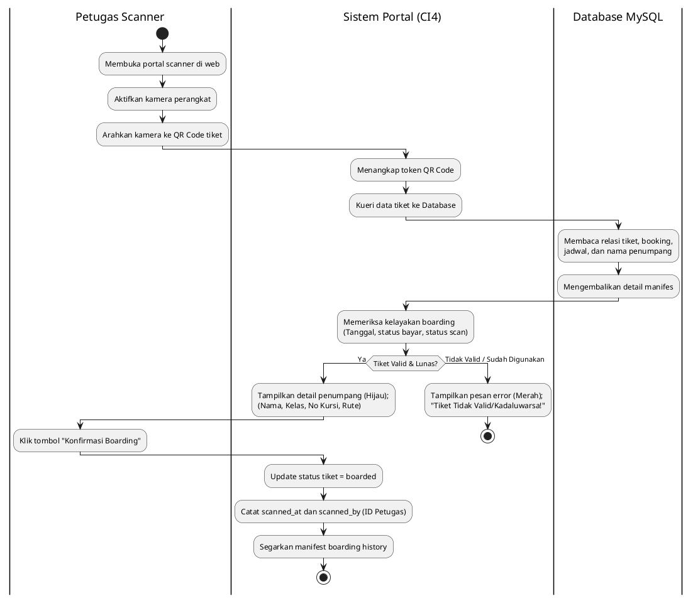

###### Script Mermaid.js (Konversi di [mermaid.live](https://mermaid.live/)):
```mermaid
graph TD
    start3([Mulai]) --> open[Buka Portal Scanner & Webcam Aktif]
    open --> scan[Arahkan Kamera ke QR Code E-Tiket]
    scan --> query3[Sistem Kirim Token QR ke DB]
    query3 --> match{Apakah Tiket Valid, Lunas & Belum Scan?}
    match -- Ya --> show_valid[Tampilkan Data Manifest Penumpang - Hijau]
    show_valid --> click[Petugas Klik Konfirmasi Boarding]
    click --> update_status[Sistem Update Tiket = Boarded]
    update_status --> save_log[Simpan scanned_at & scanned_by ke DB]
    save_log --> refresh[Refresh Tampilan Histori Boarding]
    refresh --> stop3([Selesai])
    
    match -- Tidak --> show_error[Tampilkan Pesan Error / Merah]
    show_error --> stop3
```

---

#### 3.3.4. Sequence Diagram
Sequence diagram menggambarkan interaksi antar objek dalam sistem (seperti View, Controller, Model, Database, dan API eksternal) yang disusun berdasarkan urutan waktu kejadian kronologis. Berikut adalah 2 sequence diagram utama dalam sistem e-ticketing ini:

##### 1. Sequence Diagram: Checkout Reservasi Tiket & Peta Kursi
Diagram ini memodelkan interaksi saat penumpang melakukan checkout kursi, dilindungi oleh transaksi database (*ACID compliance*) untuk mencegah kegagalan concurrency.

###### Script PlantUML (Konversi di [planttext.com](https://www.planttext.com/)):
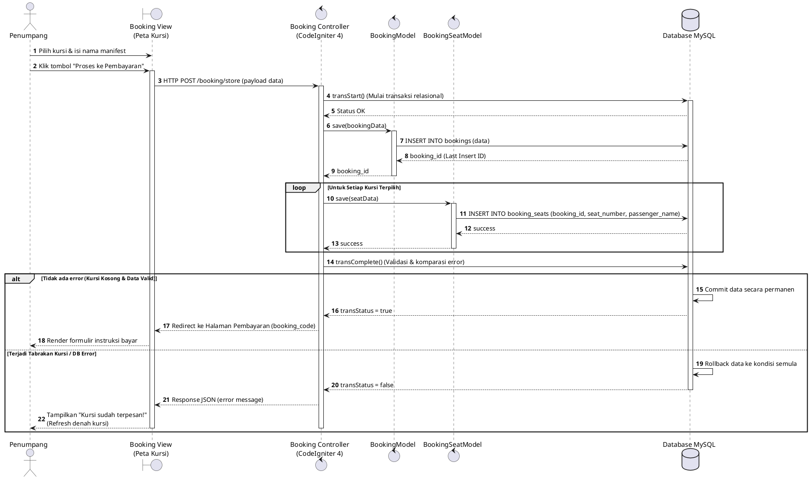

###### Script Mermaid.js (Konversi di [mermaid.live](https://mermaid.live/)):
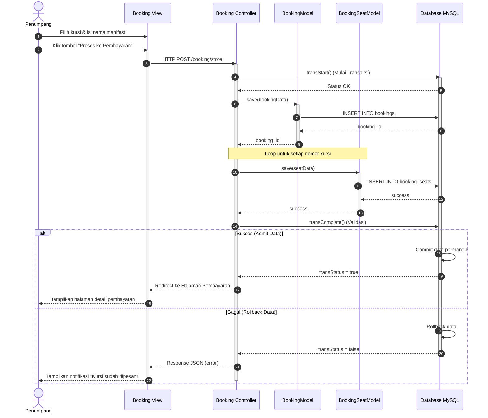

---

##### 2. Sequence Diagram: Webhook Konfirmasi Pembayaran Midtrans
Diagram ini memodelkan interaksi sistem secara asinkron ketika server Midtrans mendeteksi pelunasan tiket dari penumpang, kemudian memperbarui database dan menerbitkan e-tiket PDF.

###### Script PlantUML (Konversi di [planttext.com](https://www.planttext.com/)):
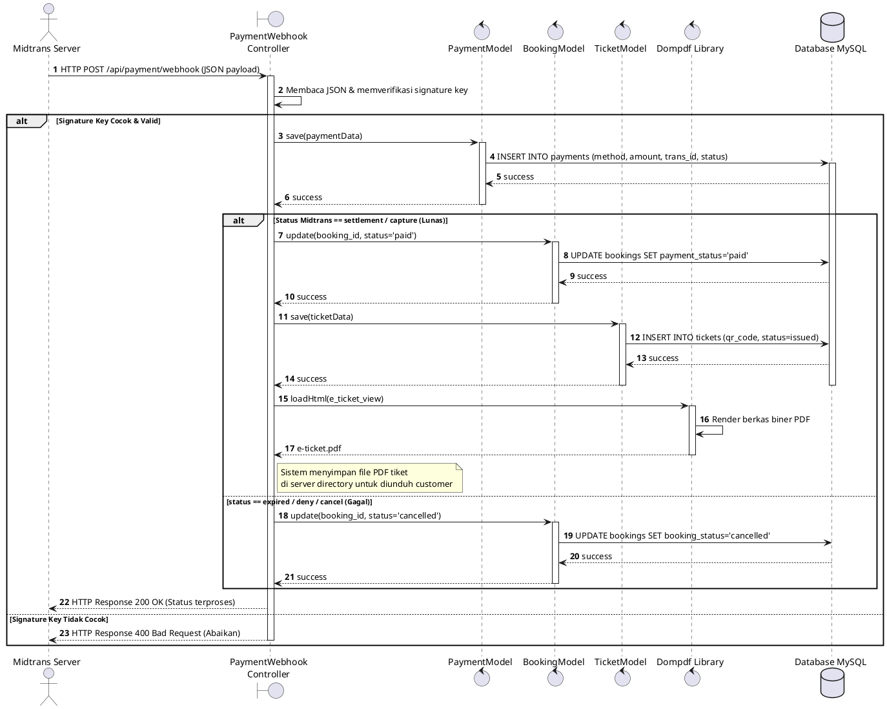

###### Script Mermaid.js (Konversi di [mermaid.live](https://mermaid.live/)):
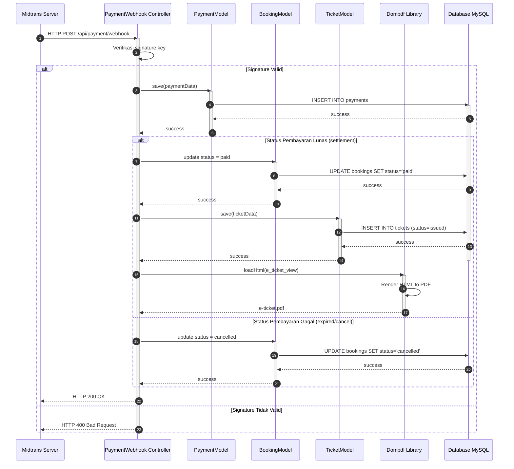

---

##### 3.3.5. Class Diagram
Class Diagram menggambarkan struktur statis sistem dengan memetakan kelas-kelas yang menyusun perangkat lunak, termasuk atribut, metode, serta hubungan ketergantungan antar-kelas. Pembangunan aplikasi menggunakan kerangka kerja CodeIgniter 4 berorientasi MVC, sehingga Class Diagram ini mendefinisikan relasi antara kelas Model, Controller, serta kelas eksternal.

*(Tempatkan Gambar Class Diagram di bawah paragraf ini)*

---

##### Kode Script Pembuat Class Diagram

Anda dapat menggunakan salah satu dari script berikut untuk digenerate langsung menjadi file gambar Class Diagram yang lengkap:

###### Opsi A: Menggunakan Script PlantUML (Sangat Direkomendasikan)
**Tempat Konversi:** Salin kode di bawah ini lalu tempel di situs **[PlantText (planttext.com)](https://www.planttext.com/)** atau **[PlantUML Online Server](http://www.plantuml.com/plantuml)** untuk mengunduh versi PNG/SVG secara gratis.

```plantuml
@startuml
skinparam classAttributeIconSize 0

package "App\Controllers" {
    class BaseController {
        # request
        # response
        # logger
        + initController()
    }

    class "Customer\Home" as CustHome {
        + index()
    }
    
    class "Customer\Search" as CustSearch {
        - scheduleModel
        + index()
    }

    class "Customer\Booking" as CustBooking {
        - bookingModel
        - bookingSeatModel
        - scheduleModel
        + create()
        + store()
    }

    class "Customer\Payment" as CustPayment {
        - bookingModel
        - paymentModel
        + index()
        + checkout()
    }

    class "Customer\Chatbot" as CustChatbot {
        - chatLogModel
        - geminiClient
        + index()
        + sendMessage()
    }

    class "Api\PaymentWebhook" as ApiWebhook {
        - bookingModel
        - paymentModel
        - ticketModel
        + index()
    }

    class "Petugas\Scan" as PetugasScan {
        - ticketModel
        - userModel
        + index()
        + confirm()
    }

    class "Admin\Dashboard" as AdminDash {
        - bookingModel
        - paymentModel
        + index()
    }

    class "Admin\Predictions" as AdminPredict {
        - scheduleModel
        - geminiClient
        + index()
    }

    class "Admin\Reviews" as AdminReviews {
        - reviewModel
        - geminiClient
        + index()
    }
}

package "App\Models" {
    class UserModel {
        # table = "users"
        # allowedFields
        + findUser()
    }

    class BusModel {
        # table = "buses"
        # allowedFields
    }

    class RouteModel {
        # table = "routes"
        # allowedFields
    }

    class ScheduleModel {
        # table = "schedules"
        # allowedFields
        + getActiveSchedules()
    }

    class BookingModel {
        # table = "bookings"
        # allowedFields
        + getDetails()
    }

    class BookingSeatModel {
        # table = "booking_seats"
        # allowedFields
    }

    class PaymentModel {
        # table = "payments"
        # allowedFields
    }

    class TicketModel {
        # table = "tickets"
        # allowedFields
    }

    class ReviewModel {
        # table = "reviews"
        # allowedFields
    }

    class ChatLogModel {
        # table = "chat_logs"
        # allowedFields
    }
}

package "App\Libraries" {
    class GeminiClient {
        - apiKey
        - apiUrl
        + callGemini()
        + predictOccupancy()
        + classifySentiment()
    }
}

' Inheritances
BaseController <|-- CustHome
BaseController <|-- CustSearch
BaseController <|-- CustBooking
BaseController <|-- CustPayment
BaseController <|-- CustChatbot
BaseController <|-- ApiWebhook
BaseController <|-- PetugasScan
BaseController <|-- AdminDash
BaseController <|-- AdminPredict
BaseController <|-- AdminReviews

' Controller to Model dependencies
CustSearch --> ScheduleModel
CustBooking --> BookingModel
CustBooking --> BookingSeatModel
CustBooking --> ScheduleModel
CustPayment --> BookingModel
CustPayment --> PaymentModel
CustChatbot --> ChatLogModel
CustChatbot --> GeminiClient
ApiWebhook --> BookingModel
ApiWebhook --> PaymentModel
ApiWebhook --> TicketModel
PetugasScan --> TicketModel
PetugasScan --> UserModel
AdminDash --> BookingModel
AdminDash --> PaymentModel
AdminPredict --> ScheduleModel
AdminPredict --> GeminiClient
AdminReviews --> ReviewModel
AdminReviews --> GeminiClient

' Model relationships (Logical representation)
UserModel "1" -- "0..*" BookingModel
ScheduleModel "1" -- "0..*" BookingModel
BookingModel "1" -- "1" PaymentModel
BookingModel "1" -- "1..*" BookingSeatModel
BookingModel "1" -- "1..*" TicketModel
BookingModel "1" -- "0..1" ReviewModel
BusModel "1" -- "0..*" ScheduleModel
RouteModel "1" -- "0..*" ScheduleModel
UserModel "1" -- "0..*" TicketModel : scanned_by
UserModel "1" -- "0..*" ChatLogModel

@endum
```

###### Opsi B: Menggunakan Script Mermaid.js (Alternatif)
**Tempat Konversi:** Salin kode di bawah ini lalu tempel di situs **[Mermaid Live Editor (mermaid.live)](https://mermaid.live/)** untuk melihat pratinjau instan dan mengunduh filenya.

```mermaid
classDiagram
    %% Inheritance
    Controller <|-- BaseController
    BaseController <|-- CustHome
    BaseController <|-- CustSearch
    BaseController <|-- CustBooking
    BaseController <|-- CustPayment
    BaseController <|-- CustChatbot
    BaseController <|-- ApiWebhook
    BaseController <|-- PetugasScan
    BaseController <|-- AdminDash
    BaseController <|-- AdminPredict
    BaseController <|-- AdminReviews

    class BaseController {
        +request
        +response
        +logger
        +initController()
    }

    class CustHome {
        +index()
    }

    class CustSearch {
        -ScheduleModel scheduleModel
        +index()
    }

    class CustBooking {
        -BookingModel bookingModel
        -BookingSeatModel bookingSeatModel
        -ScheduleModel scheduleModel
        +create()
        +store()
    }

    class CustPayment {
        -BookingModel bookingModel
        -PaymentModel paymentModel
        +index()
        +checkout()
    }

    class CustChatbot {
        -ChatLogModel chatLogModel
        -GeminiClient geminiClient
        +index()
        +sendMessage()
    }

    class ApiWebhook {
        -BookingModel bookingModel
        -PaymentModel paymentModel
        -TicketModel ticketModel
        +index()
    }

    class PetugasScan {
        -TicketModel ticketModel
        -UserModel userModel
        +index()
        +confirm()
    }

    class AdminDash {
        -BookingModel bookingModel
        -PaymentModel paymentModel
        +index()
    }

    class AdminPredict {
        -ScheduleModel scheduleModel
        -GeminiClient geminiClient
        +index()
    }

    class AdminReviews {
        -ReviewModel reviewModel
        -GeminiClient geminiClient
        +index()
    }

    %% Models
    class UserModel {
        +string table
        +array allowedFields
    }
    class BusModel {
        +string table
    }
    class RouteModel {
        +string table
    }
    class ScheduleModel {
        +string table
    }
    class BookingModel {
        +string table
    }
    class BookingSeatModel {
        +string table
    }
    class PaymentModel {
        +string table
    }
    class TicketModel {
        +string table
    }
    class ReviewModel {
        +string table
    }
    class ChatLogModel {
        +string table
    }

    %% Libraries
    class GeminiClient {
        -string apiKey
        -string apiUrl
        +callGemini()
        +predictOccupancy()
        +classifySentiment()
    }

    %% Usage Relations
    CustSearch ..> ScheduleModel : uses
    CustBooking ..> BookingModel : uses
    CustBooking ..> BookingSeatModel : uses
    CustPayment ..> BookingModel : uses
    CustPayment ..> PaymentModel : uses
    CustChatbot ..> ChatLogModel : uses
    CustChatbot ..> GeminiClient : uses
    ApiWebhook ..> BookingModel : uses
    ApiWebhook ..> PaymentModel : uses
    ApiWebhook ..> TicketModel : uses
    PetugasScan ..> TicketModel : uses
    PetugasScan ..> UserModel : uses
    AdminDash ..> BookingModel : uses
    AdminPredict ..> ScheduleModel : uses
    AdminPredict ..> GeminiClient : uses
    AdminReviews ..> ReviewModel : uses
    AdminReviews ..> GeminiClient : uses
```

---

---

### 3.4. Perancangan Basis Data
Perancangan basis data merupakan tahapan penting untuk memetakan kebutuhan penyimpanan data aplikasi secara terstruktur, konsisten, dan efisien. Pada sistem E-Ticketing Bus Online ini, basis data dirancang menggunakan sistem manajemen basis data relasional (RDBMS) MySQL. Perancangan basis data bertujuan untuk menjaga integritas data melalui mekanisme *foreign key constraints*, meminimalkan redundansi data melalui proses normalisasi, serta mempercepat pencarian data jadwal dan manifes penumpang.

#### 3.4.1. Entity Relationship Diagram (ERD)
Entity Relationship Diagram (ERD) menggambarkan hubungan logis antar-entitas dalam basis data sistem e-ticketing. Hubungan antar-tabel dalam sistem ini didasarkan pada kardinalitas relasi relasional seperti *one-to-many* (satu-ke-banyak) dan *one-to-one* (satu-ke-satu) sebagai berikut:
1. **Entitas `buses` dan `users` (Kru Bus):** Relasi *one-to-many* dari `buses` ke `users` (dihubungkan oleh `bus_id`). Satu armada bus dapat dialokasikan untuk beberapa kru (supir 1, supir 2, dan kondektur), namun setiap kru hanya terafiliasi dengan satu bus pada satu waktu.
2. **Entitas `routes` dan `schedules`:** Relasi *one-to-many* (dihubungkan oleh `route_id`). Satu trayek rute perjalanan dapat memiliki banyak jadwal keberangkatan bus yang berbeda tanggal dan jam operasionalnya.
3. **Entitas `buses` dan `schedules`:** Relasi *one-to-many* (dihubungkan oleh `bus_id`). Satu armada bus dapat dijadwalkan untuk melakukan banyak perjalanan pada waktu yang berbeda.
4. **Entitas `users` (Kru/Driver) dan `schedules`:** Relasi *one-to-many* (dihubungkan oleh `driver_1_id`, `driver_2_id`, dan `conductor_id`). Seorang supir atau kondektur dapat ditugaskan pada banyak jadwal perjalanan yang berbeda.
5. **Entitas `users` (Customer) dan `bookings`:** Relasi *one-to-many* (dihubungkan oleh `user_id`). Seorang penumpang dapat melakukan banyak transaksi pemesanan tiket dari waktu ke waktu.
6. **Entitas `schedules` dan `bookings`:** Relasi *one-to-many* (dihubungkan oleh `schedule_id`). Satu jadwal perjalanan bus dapat menerima banyak pemesanan tiket dari berbagai penumpang hingga kapasitas kursi terpenuhi.
7. **Entitas `bookings` dan `booking_seats`:** Relasi *one-to-many* (dihubungkan oleh `booking_id`). Satu transaksi pemesanan dapat memesan beberapa kursi sekaligus, dan masing-masing kursi mencatat nama manifest penumpang.
8. **Entitas `bookings` dan `payments`:** Relasi *one-to-one* (dihubungkan oleh `booking_id`). Satu booking memiliki tepat satu catatan status pembayaran Midtrans di tabel `payments`.
9. **Entitas `bookings` dan `tickets`:** Relasi *one-to-many* (dihubungkan oleh `booking_id`). Satu transaksi pemesanan yang sukses akan menghasilkan e-tiket resmi di tabel `tickets` untuk setiap manifest kursi yang dipesan.
10. **Entitas `users` (Petugas Scanner) dan `tickets`:** Relasi *one-to-many* (dihubungkan oleh `scanned_by`). Seorang petugas scanner dapat melakukan pemindaian (*check-in*) pada banyak tiket penumpang.
11. **Entitas `bookings` dan `reviews`:** Relasi *one-to-one* (dihubungkan oleh `booking_id`). Satu booking yang telah selesai perjalanannya dapat memberikan satu ulasan umpan balik.
12. **Entitas `users` dan `chat_logs`:** Relasi *one-to-many* (dihubungkan oleh `user_id`). Satu akun pengguna dapat memiliki riwayat interaksi obrolan dengan chatbot rekomendasi AI.

*(Tempatkan Gambar ERD Basis Data di bawah paragraf ini)*

---

##### Kode Script Pembuat ERD

Anda dapat menggunakan salah satu dari script berikut untuk digenerate langsung menjadi file gambar ERD yang lengkap:

###### Opsi A: Menggunakan Script PlantUML (Sangat Direkomendasikan untuk Skripsi/UAS)
**Tempat Konversi:** Salin kode di bawah ini lalu tempel di situs **[PlantText (planttext.com)](https://www.planttext.com/)** atau **[PlantUML Online Server (www.plantuml.com/plantuml)](http://www.plantuml.com/plantuml)** untuk mengunduh versi PNG/SVG secara gratis.

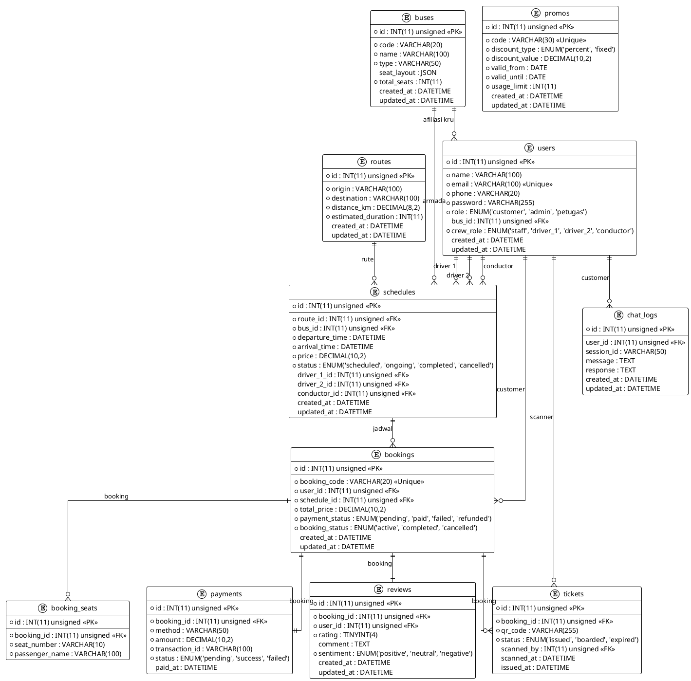

###### Opsi B: Menggunakan Script Mermaid.js (Alternatif)
**Tempat Konversi:** Salin kode di bawah ini lalu tempel di situs **[Mermaid Live Editor (mermaid.live)](https://mermaid.live/)** untuk melihat pratinjau instan dan mengunduh filenya.

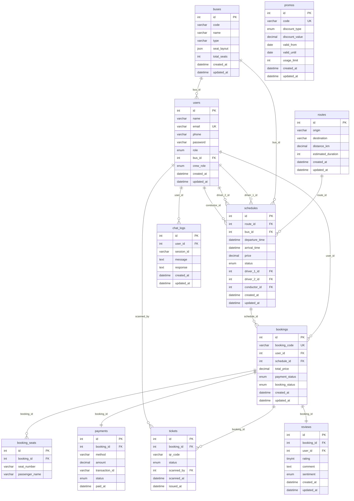

###### Opsi C: Menggunakan Script DBML (dbdiagram.io)
**Tempat Konversi:** Salin kode di bawah ini lalu tempel di situs **[dbdiagram.io](https://dbdiagram.io/)** untuk memvisualisasikan skema database relasional secara interaktif dan menghasilkan kode SQL siap pakai.

```dbml
enum user_role {
  customer
  admin
  petugas
}

enum crew_role_type {
  staff
  driver_1
  driver_2
  conductor
}

enum schedule_status {
  scheduled
  ongoing
  completed
  cancelled
}

enum discount_type {
  percent
  fixed
}

enum payment_status_type {
  pending
  paid
  failed
  refunded
}

enum booking_status_type {
  active
  completed
  cancelled
}

enum payment_gateway_status {
  pending
  success
  failed
}

enum ticket_status {
  issued
  boarded
  expired
}

enum sentiment_type {
  positive
  neutral
  negative
}

Table users {
  id integer [primary key, increment]
  name varchar(100)
  email varchar(100) [unique]
  phone varchar(20)
  password varchar(255)
  role user_role [default: 'customer']
  bus_id integer [null]
  crew_role crew_role_type [default: 'staff']
  created_at datetime
  updated_at datetime
}

Table buses {
  id integer [primary key, increment]
  code varchar(20)
  name varchar(100)
  type varchar(50)
  seat_layout json
  total_seats integer
  created_at datetime
  updated_at datetime
}

Table routes {
  id integer [primary key, increment]
  origin varchar(100)
  destination varchar(100)
  distance_km decimal(8,2)
  estimated_duration integer
  created_at datetime
  updated_at datetime
}

Table schedules {
  id integer [primary key, increment]
  route_id integer
  bus_id integer
  departure_time datetime
  arrival_time datetime
  price decimal(10,2)
  status schedule_status [default: 'scheduled']
  driver_1_id integer [null]
  driver_2_id integer [null]
  conductor_id integer [null]
  created_at datetime
  updated_at datetime
}

Table promos {
  id integer [primary key, increment]
  code varchar(30) [unique]
  discount_type discount_type
  discount_value decimal(10,2)
  valid_from date
  valid_until date
  usage_limit integer
  created_at datetime
  updated_at datetime
}

Table bookings {
  id integer [primary key, increment]
  booking_code varchar(20) [unique]
  user_id integer
  schedule_id integer
  total_price decimal(10,2)
  payment_status payment_status_type [default: 'pending']
  booking_status booking_status_type [default: 'active']
  created_at datetime
  updated_at datetime
}

Table booking_seats {
  id integer [primary key, increment]
  booking_id integer
  seat_number varchar(10)
  passenger_name varchar(100)
}

Table payments {
  id integer [primary key, increment]
  booking_id integer
  method varchar(50)
  amount decimal(10,2)
  transaction_id varchar(100)
  status payment_gateway_status [default: 'pending']
  paid_at datetime
}

Table tickets {
  id integer [primary key, increment]
  booking_id integer
  qr_code varchar(255)
  status ticket_status [default: 'issued']
  scanned_by integer [null]
  scanned_at datetime
  issued_at datetime
}

Table reviews {
  id integer [primary key, increment]
  booking_id integer
  user_id integer
  rating tinyint
  comment text
  sentiment sentiment_type
  created_at datetime
  updated_at datetime
}

Table chat_logs {
  id integer [primary key, increment]
  user_id integer [null]
  session_id varchar(50)
  message text
  response text
  created_at datetime
  updated_at datetime
}

// Relationships
Ref: buses.id < users.bus_id [update: cascade, delete: set null]
Ref: routes.id < schedules.route_id
Ref: buses.id < schedules.bus_id
Ref: users.id < schedules.driver_1_id [update: cascade, delete: set null]
Ref: users.id < schedules.driver_2_id [update: cascade, delete: set null]
Ref: users.id < schedules.conductor_id [update: cascade, delete: set null]
Ref: users.id < bookings.user_id
Ref: schedules.id < bookings.schedule_id
Ref: bookings.id < booking_seats.booking_id
Ref: bookings.id - payments.booking_id // one-to-one
Ref: bookings.id < tickets.booking_id
Ref: users.id < tickets.scanned_by [update: cascade, delete: set null]
Ref: bookings.id - reviews.booking_id // one-to-one
Ref: users.id < chat_logs.user_id
```

#### 3.4.2. Kamus Data (Data Dictionary)
Kamus data menjelaskan secara rinci spesifikasi teknis dari setiap tabel yang digunakan dalam sistem E-Ticketing Bus Online, meliputi nama kolom, tipe data, kunci (key), serta keterangan fungsinya.

##### 1. Tabel users
Tabel ini digunakan untuk menyimpan seluruh data pengguna aplikasi yang terbagi menjadi tiga peran utama (*customer*, *admin*, *petugas*), serta kru bus (*driver* dan *conductor*).

**Struktur Kolom:**
* **id** (INT(11) unsigned, PK, Auto Increment): ID unik untuk setiap pengguna
* **name** (VARCHAR(100)): Nama lengkap pengguna
* **email** (VARCHAR(100), Unique): Alamat email unik untuk login
* **phone** (VARCHAR(20)): Nomor telepon aktif pengguna
* **password** (VARCHAR(255)): Kata sandi pengguna yang di-hash dengan BCrypt
* **role** (ENUM('customer', 'admin', 'petugas')): Hak akses sistem (default: 'customer')
* **bus_id** (INT(11) unsigned, FK (buses.id)): Afiliasi bus untuk kru (Null jika bukan kru)
* **crew_role** (ENUM('staff', 'driver_1', 'driver_2', 'conductor')): Peran spesifik kru bus (default: 'staff')
* **created_at** (DATETIME): Tanggal dan waktu akun didaftarkan
* **updated_at** (DATETIME): Tanggal dan waktu data akun diperbarui


##### 2. Tabel buses
Tabel ini digunakan untuk menyimpan informasi armada bus PO Bus yang dimiliki.

**Struktur Kolom:**
* **id** (INT(11) unsigned, PK, Auto Increment): ID unik untuk setiap armada bus
* **code** (VARCHAR(20)): Kode identifikasi bus (misal: PO-001)
* **name** (VARCHAR(100)): Nama atau lambung bus
* **type** (VARCHAR(50)): Tipe kelas bus (misal: Eksekutif, Ekonomi)
* **seat_layout** (JSON): Struktur tata letak denah kursi bus
* **total_seats** (INT(11)): Kapasitas total kursi bus
* **created_at** (DATETIME): Tanggal dan waktu armada bus ditambahkan
* **updated_at** (DATETIME): Tanggal dan waktu data armada diperbarui


##### 3. Tabel routes
Tabel ini digunakan untuk menyimpan data rute perjalanan atau trayek antarkota yang dilayani.

**Struktur Kolom:**
* **id** (INT(11) unsigned, PK, Auto Increment): ID unik untuk setiap rute
* **origin** (VARCHAR(100)): Terminal/Kota asal keberangkatan
* **destination** (VARCHAR(100)): Terminal/Kota tujuan akhir perjalanan
* **distance_km** (DECIMAL(8,2)): Jarak tempuh rute dalam satuan kilometer
* **estimated_duration** (INT(11)): Estimasi durasi perjalanan (dalam menit)
* **created_at** (DATETIME): Tanggal dan waktu rute ditambahkan
* **updated_at** (DATETIME): Tanggal dan waktu data rute diperbarui


##### 4. Tabel schedules
Tabel ini digunakan untuk menyimpan jadwal keberangkatan bus beserta penetapan kru bus yang bertugas dan harga tiket.

**Struktur Kolom:**
* **id** (INT(11) unsigned, PK, Auto Increment): ID unik untuk setiap jadwal perjalanan
* **route_id** (INT(11) unsigned, FK (routes.id)): Rute perjalanan yang ditempuh
* **bus_id** (INT(11) unsigned, FK (buses.id)): Armada bus yang ditugaskan
* **departure_time** (DATETIME): Tanggal dan jam keberangkatan bus
* **arrival_time** (DATETIME): Estimasi tanggal dan jam kedatangan
* **price** (DECIMAL(10,2)): Harga dasar tiket per kursi
* **status** (ENUM('scheduled', 'ongoing', 'completed', 'cancelled')): Status operasional jadwal (default: 'scheduled')
* **driver_1_id** (INT(11) unsigned, FK (users.id)): ID Supir Utama (driver 1) yang bertugas
* **driver_2_id** (INT(11) unsigned, FK (users.id)): ID Supir Cadangan (driver 2) jika ada
* **conductor_id** (INT(11) unsigned, FK (users.id)): ID Kondektur yang bertugas
* **created_at** (DATETIME): Tanggal dan waktu jadwal dibuat
* **updated_at** (DATETIME): Tanggal dan waktu jadwal diperbarui


##### 5. Tabel promos
Tabel ini digunakan untuk menyimpan data voucher promo diskon yang dapat diklaim saat checkout tiket.

**Struktur Kolom:**
* **id** (INT(11) unsigned, PK, Auto Increment): ID unik untuk setiap promo
* **code** (VARCHAR(30), Unique): Kode promo/kupon unik (misal: MUDIKAMAN)
* **discount_type** (ENUM('percent', 'fixed')): Jenis diskon (persentase atau nominal tetap)
* **discount_value** (DECIMAL(10,2)): Nilai potongan harga
* **valid_from** (DATE): Batas awal tanggal kupon aktif
* **valid_until** (DATE): Batas akhir tanggal kupon aktif
* **usage_limit** (INT(11)): Kuota batas maksimum penggunaan kupon
* **created_at** (DATETIME): Tanggal dan waktu promo dibuat
* **updated_at** (DATETIME): Tanggal dan waktu promo diperbarui


##### 6. Tabel bookings
Tabel ini digunakan untuk menyimpan data transaksi reservasi tiket bus oleh customer.

**Struktur Kolom:**
* **id** (INT(11) unsigned, PK, Auto Increment): ID unik untuk setiap booking
* **booking_code** (VARCHAR(20), Unique): Kode unik invoice pemesanan
* **user_id** (INT(11) unsigned, FK (users.id)): ID customer yang melakukan reservasi
* **schedule_id** (INT(11) unsigned, FK (schedules.id)): ID jadwal perjalanan yang dipesan
* **total_price** (DECIMAL(10,2)): Total tagihan akhir setelah potongan diskon
* **payment_status** (ENUM('pending', 'paid', 'failed', 'refunded')): Status transaksi pembayaran (default: 'pending')
* **booking_status** (ENUM('active', 'completed', 'cancelled')): Status keaktifan reservasi (default: 'active')
* **created_at** (DATETIME): Tanggal dan waktu pesanan dibuat
* **updated_at** (DATETIME): Tanggal dan waktu data pesanan diperbarui


##### 7. Tabel booking_seats
Tabel ini digunakan untuk mencatat detail manifest nama penumpang beserta alokasi nomor kursi yang dipilih pada setiap transaksi booking.

**Struktur Kolom:**
* **id** (INT(11) unsigned, PK, Auto Increment): ID unik baris manifest kursi
* **booking_id** (INT(11) unsigned, FK (bookings.id)): Referensi ke transaksi booking induk
* **seat_number** (VARCHAR(10)): Nomor kursi yang dipesan (misal: 1A, 2B)
* **passenger_name** (VARCHAR(100)): Nama penumpang yang menempati kursi tersebut


##### 8. Tabel payments
Tabel ini menyimpan detail transaksi pembayaran digital dari payment gateway Midtrans.

**Struktur Kolom:**
* **id** (INT(11) unsigned, PK, Auto Increment): ID unik transaksi pembayaran
* **booking_id** (INT(11) unsigned, FK (bookings.id)): ID booking yang dibayar
* **method** (VARCHAR(50)): Metode pembayaran (misal: bank_transfer, qris)
* **amount** (DECIMAL(10,2)): Jumlah nominal pembayaran yang disetor
* **transaction_id** (VARCHAR(100)): ID transaksi resmi dari Midtrans
* **status** (ENUM('pending', 'success', 'failed')): Status pelunasan pembayaran (default: 'pending')
* **paid_at** (DATETIME): Waktu tepat transaksi terbayar lunas


##### 9. Tabel tickets
Tabel ini mencatat tiket elektronik penumpang yang diterbitkan otomatis setelah pembayaran lunas beserta log scanner boarding petugas.

**Struktur Kolom:**
* **id** (INT(11) unsigned, PK, Auto Increment): ID unik tiket elektronik
* **booking_id** (INT(11) unsigned, FK (bookings.id)): ID booking transaksi asal
* **qr_code** (VARCHAR(255)): Data token enkripsi untuk QR Code e-ticket
* **status** (ENUM('issued', 'boarded', 'expired')): Status boarding tiket (default: 'issued')
* **scanned_by** (INT(11) unsigned, FK (users.id)): ID petugas scanner yang memindai tiket
* **scanned_at** (DATETIME): Tanggal dan waktu pemindaian boarding
* **issued_at** (DATETIME): Tanggal dan waktu tiket diterbitkan


##### 10. Tabel reviews
Tabel ini digunakan untuk menyimpan rating, ulasan perjalanan, dan hasil analisis sentimen AI dari penumpang.

**Struktur Kolom:**
* **id** (INT(11) unsigned, PK, Auto Increment): ID unik data ulasan
* **booking_id** (INT(11) unsigned, FK (bookings.id)): ID transaksi perjalanan terkait
* **user_id** (INT(11) unsigned, FK (users.id)): ID customer pemberi ulasan
* **rating** (TINYINT(4)): Skor penilaian (rating 1-5 bintang)
* **comment** (TEXT): Isi pesan ulasan tertulis dari customer
* **sentiment** (ENUM('positive', 'neutral', 'negative')): Klasifikasi sentimen otomatis berbasis Gemini AI
* **created_at** (DATETIME): Tanggal dan waktu ulasan dikirim
* **updated_at** (DATETIME): Tanggal dan waktu ulasan diperbarui


##### 11. Tabel chat_logs
Tabel ini menyimpan data log riwayat komunikasi asisten chatbot rekomendasi perjalanan bus berbasis Gemini AI.

**Struktur Kolom:**
* **id** (INT(11) unsigned, PK, Auto Increment): ID unik log pesan chat
* **user_id** (INT(11) unsigned, FK (users.id)): ID customer pengirim chat (Null jika guest)
* **session_id** (VARCHAR(50)): Sesi identifikasi obrolan chat
* **message** (TEXT): Pesan teks pertanyaan dari pengguna
* **response** (TEXT): Jawaban teks balasan dari chatbot Gemini AI
* **created_at** (DATETIME): Tanggal dan waktu pesan dikirim
* **updated_at** (DATETIME): Tanggal dan waktu data log diperbarui

---

### 3.5. Rancangan Antarmuka Pengguna (Mockup UI)
Perancangan antarmuka pengguna (*User Interface/UI*) bertujuan untuk menjembatani interaksi antara aktor (Penumpang, Petugas, dan Admin) dengan sistem secara intuitif, efisien, dan memiliki estetika visual yang premium. Desain antarmuka aplikasi E-Ticketing Bus ini dirancang menggunakan prinsip-prinsip desain modern seperti tata letak yang responsif (*responsive grid*), skema warna bertema gelap dan terang yang harmonis (menggunakan aksen warna biru dongker, putih bersih, dan abu-abu satin), serta tipografi bersih menggunakan Google Fonts (Inter dan Outfit).

Berikut adalah rancangan antarmuka pengguna beserta penjelasan fungsional komponen utama dari setiap halaman:

#### 3.5.1. Halaman Beranda Utama & Chatbot AI (Customer Portal)
Halaman ini merupakan pintu masuk utama penumpang untuk melakukan pemesanan tiket. Halaman ini memadukan form pencarian jadwal bus konvensional dengan *floating widget* chatbot cerdas berbasis AI.

<p align="center"><em>Gambar 3.5.1 Mockup Halaman Beranda Utama & Chatbot AI</em></p>

**Deskripsi Desain & Layout:**
Desain beranda didominasi oleh spanduk utama (*hero banner*) dengan gradasi warna biru gelap ke nila (*indigo gradient*) yang bersih. Di tengah halaman terdapat panel pencarian tiket dengan efek kaca buram (*glassmorphism*) untuk menonjolkan formulir masukan. Di pojok kanan bawah, terdapat tombol mengambang (*floating button*) berbentuk ikon gelembung pesan yang jika diklik akan membuka jendela obrolan asisten chatbot AI.

**Komponen Utama:**
* **Formulir Input:** Dropdown pilihan kota asal keberangkatan, kota tujuan, pemilih tanggal (*datepicker*), dan tombol "Cari Tiket".
* **Widget Chatbot AI:** Area percakapan interaktif tempat penumpang mengetikkan pertanyaan konsultasi rute atau jam operasional. Chatbot ini terhubung langsung ke API Gemini AI.

**Fungsi & Interaksi:**
Saat penumpang mengklik tombol pencarian, sistem memvalidasi kelengkapan data input dan mengarahkan ke halaman hasil pencarian. Ketika jendela chatbot dibuka, penumpang dapat berkonsultasi secara alami tentang rute terpendek, tarif rata-rata, atau ketersediaan kelas bus, yang dijawab langsung oleh AI dengan memproses basis pengetahuan jadwal bus PO.

#### 3.5.2. Halaman Hasil Pencarian Jadwal Bus
Halaman ini menyajikan daftar jadwal keberangkatan bus yang aktif sesuai rute dan tanggal yang dicari oleh penumpang.

<p align="center"><em>Gambar 3.5.2 Mockup Halaman Hasil Pencarian Jadwal Bus</em></p>

**Deskripsi Desain & Layout:**
Halaman ini disusun menggunakan struktur baris kartu (*list of card components*) vertikal. Setiap kartu mewakili satu jadwal perjalanan dengan pembagian kolom yang rapi untuk memisahkan informasi waktu, tipe bus, harga, dan sisa tempat duduk.

**Komponen Utama:**
* **Informasi Waktu Keberangkatan & Kedatangan:** Ditampilkan dengan teks berukuran besar berbobot tebal (*bold*), dilengkapi ikon jam dan arah panah.
* **Tag Kelas Armada:** Badge berwarna biru muda untuk kelas "Executive" dan hijau muda untuk "Economy".
* **Informasi Kursi & Harga:** Label sisa kapasitas kursi (misal: "Sisa 12 Kursi") dan harga tiket per kursi yang diformat ke Rupiah tebal.
* **Tombol Interaksi:** Tombol "Pilih Kursi" berwarna biru cerah dengan efek transisi melayang (*hover shadow effect*) saat disorot kursor.

**Fungsi & Interaksi:**
Pengguna dapat memfilter hasil pencarian berdasarkan jam keberangkatan atau rentang harga tiket. Mengklik tombol "Pilih Kursi" akan membawa pengguna masuk ke proses reservasi dinamis.

#### 3.5.3. Halaman Pemesanan & Peta Kursi (Booking Seat Map)
Halaman ini adalah modul interaktif tempat penumpang memilih lokasi kursi yang diinginkan di dalam bus serta mengisi data manifest penumpang.

<p align="center"><em>Gambar 3.5.3 Mockup Halaman Pemesanan & Peta Kursi (Booking Seat Map)</em></p>

**Deskripsi Desain & Layout:**
Tata letak dibagi menjadi dua kolom utama (*two-column grid layout*). Kolom kiri menyajikan representasi grafis denah susunan kursi di dalam bus (layout 2x2) dengan lorong tengah. Kolom kanan berisi form isian dinamis manifest penumpang sesuai nomor kursi yang dipilih.

**Komponen Utama:**
* **Grid Denah Kursi:** Kotak-kotak kecil dengan nomor kursi (misal: 1A, 1B). Kursi kosong berwarna biru muda dengan batas biru tua. Kursi yang terisi diarsir warna abu-abu gelap dengan ikon tanda silang (tidak dapat diklik). Kursi yang dipilih penumpang berubah warna menjadi hijau cerah.
* **Formulir Manifest:** Input teks dinamis untuk menuliskan "Nama Penumpang" untuk tiap kursi yang diklik.
* **Ringkasan Pesanan & Tombol Checkout:** Menampilkan detail total harga kursi yang dipilih dan tombol "Lanjutkan ke Pembayaran".

**Fungsi & Interaksi:**
Interaksi klik pada peta kursi dikendalikan oleh Javascript di sisi klien. Ketika sebuah kursi diklik, sistem secara otomatis merender satu baris form input nama manifest baru di kolom sebelah kanan secara instan tanpa memuat ulang halaman (*real-time DOM insertion*).

#### 3.5.4. Halaman Pembayaran & Detail Invoice (Payment Gateway)
Halaman ini menampilkan rincian total transaksi pemesanan beserta status tagihan yang terintegrasi dengan gerbang pembayaran Midtrans.

<p align="center"><em>Gambar 3.5.4 Mockup Halaman Pembayaran & Detail Invoice (Payment Gateway)</em></p>

**Deskripsi Desain & Layout:**
Desain menggunakan tata letak kartu tunggal minimalis (*single card layout*) di tengah layar, memberikan fokus penuh kepada pengguna untuk menyelesaikan transaksi keuangan. Area teks kode booking disajikan menonjol dengan bingkai bergaris putus-putus.

**Komponen Utama:**
* **Detail Invoice:** Kode pemesanan (*booking code*), nama bus, rute perjalanan, tanggal operasional, nomor kursi yang dipesan, dan total nominal tagihan pembayaran.
* **Kotak Input Kode Promo:** Kolom isian teks voucher diskon beserta tombol "Terapkan".
* **Tombol "Bayar Sekarang":** Tombol pembayaran utama yang akan mengaktifkan pustaka JavaScript Midtrans Snap.

**Fungsi & Interaksi:**
Jika pengguna memasukkan kode promo aktif, sistem memproses AJAX request ke database, menghitung potongan harga, dan langsung mengupdate nominal tagihan secara dinamis. Mengklik tombol "Bayar Sekarang" akan memicu munculnya *overlay modal* aman dari Midtrans yang menawarkan berbagai opsi transfer bank (Virtual Account) dan e-Wallet (QRIS).

#### 3.5.5. Halaman Tiket Sukses & Unduh PDF
Setelah sistem menerima notifikasi keberhasilan pembayaran dari webhook Midtrans, penumpang dialihkan ke halaman konfirmasi penyelesaian transaksi.

<p align="center"><em>Gambar 3.5.5 Mockup Halaman Tiket Sukses & Unduh PDF</em></p>

**Deskripsi Desain & Layout:**
Layout didesain bertema perayaan sukses dengan ilustrasi ikon centang hijau besar yang beranimasi halus. Di bagian bawah disajikan kartu e-tiket digital yang siap dicetak.

**Komponen Utama:**
* **Badge Status:** Bertuliskan "Pembayaran Lunas" (*Paid*) berwarna hijau terang.
* **QR Code E-Ticket:** Kode QR dinamis yang merepresentasikan kode booking terenkripsi untuk divalidasi saat boarding.
* **Tombol Aksi:** Tombol "Download E-Ticket PDF" untuk mengekspor e-tiket dalam format dokumen siap cetak resmi, serta tombol "Kembali ke Beranda".

**Fungsi & Interaksi:**
Mengklik tombol cetak tiket akan mengeksekusi library Dompdf di server untuk mengunduh berkas PDF tiket yang berisi detail manifest, rute rincian, dan QR Code boarding pass.

#### 3.5.6. Halaman Portal Scanner Boarding (Officer Portal)
Antarmuka khusus yang digunakan oleh petugas terminal untuk memvalidasi tiket fisik atau e-tiket penumpang saat pintu masuk keberangkatan.

<p align="center"><em>Gambar 3.5.6 Mockup Portal Scanner Boarding (Officer Portal)</em></p>

**Deskripsi Desain & Layout:**
Layout dirancang berorientasi pada fungsionalitas kecepatan operasional lapangan. Layar dibagi menjadi dua bagian: jendela aktif pemindai kamera (*kamera feed*) di sebelah kiri, dan tabel manifest history penumpang yang ter-scan di sebelah kanan.

**Komponen Utama:**
* **Jendela Scanner:** Canvas video aktif yang dikontrol oleh pustaka scanner JavaScript (`Html5QrcodeScanner`) untuk mendeteksi QR Code via kamera smartphone/laptop.
* **Panel Hasil Validasi:** Pop-up dinamis yang menampilkan info nama penumpang, rute bus, dan status tiket ("Valid" berwarna hijau atau "Tidak Valid" berwarna merah).
* **Tombol "Konfirmasi Boarding":** Tombol untuk mencatat status masuk bus penumpang ke database.

**Fungsi & Interaksi:**
Kamera secara otomatis memindai QR Code tiket. Begitu terdeteksi, sistem mengirimkan request API untuk memvalidasi token. Hasil pencocokan database akan ditampilkan secara instan. Jika petugas menekan tombol konfirmasi, status tiket diperbarui menjadi `boarded` dan manifes terbaru langsung terdaftar dalam tabel log riwayat di sisi kanan halaman.

#### 3.5.7. Halaman Dashboard Utama Admin (Statistik & Finansial)
Halaman sentral bagi administrator untuk memantau indikator kinerja utama PO Bus, meliputi penjualan tiket, pendapatan, dan statistik operasional.

<p align="center"><em>Gambar 3.5.7 Mockup Dashboard Utama Admin (Statistik & Finansial)</em></p>

**Deskripsi Desain & Layout:**
Desain menggunakan tata letak panel admin profesional (*admin dashboard layout*) dengan bilah navigasi samping (*responsive sidebar*) berwarna gelap. Area konten utama diisi dengan kartu indikator ringkasan (*summary widgets*) diikuti dengan grafik analitik interaktif.

**Komponen Utama:**
* **Kartu Indikator Ringkasan:** Menampilkan total pendapatan rupiah, jumlah jadwal aktif, total transaksi tiket terjual, dan jumlah kru yang terdaftar.
* **Grafik Penjualan Interaktif:** Grafik garis (*line chart*) atau grafik batang (*bar chart*) yang dinamis menggunakan Chart.js untuk memantau fluktuasi pendapatan harian/bulanan.
* **Tabel Transaksi Terkini:** Daftar 5 transaksi booking terbaru beserta status pembayarannya.

**Fungsi & Interaksi:**
Administrator dapat mengubah periode waktu filter laporan (misal: mingguan atau bulanan) secara langsung, dan grafik akan beranimasi memperbarui datanya secara dinamis via AJAX.

#### 3.5.8. Halaman Prediksi Okupansi AI Admin (Gemini AI Predictions)
Halaman analitik tingkat lanjut yang menyajikan prediksi tingkat keterisian kursi untuk jadwal operasional bus dalam jangka waktu 7 hari ke depan.

<p align="center"><em>Gambar 3.5.8 Mockup Halaman Prediksi Okupansi AI Admin (Gemini AI Predictions)</em></p>

**Deskripsi Desain & Layout:**
Layout berfokus pada penyajian data kuantitatif dan kualitatif. Halaman menyajikan tabel ramalan jadwal masa depan, lengkap dengan visualisasi persentase tingkat keterisian prediksi (*occupancy prediction progress bar*) dan kotak analisis deskriptif AI.

**Komponen Utama:**
* **Tabel Jadwal Mendatang:** Daftar rute, bus, dan waktu keberangkatan 7 hari ke depan.
* **Progress Bar Okupansi:** Bilah persentase keterisian prediksi (warna merah jika okupansi rendah <40%, kuning jika sedang 40-70%, dan hijau jika okupansi tinggi >70%).
* **Panel Analisis AI:** Kotak teks berisi umpan balik naratif dari Gemini AI yang menyarankan strategi operasional (misal: "Rute Jakarta-Bandung pada hari Jumat sore diprediksi penuh, disarankan menambah armada tambahan").

**Fungsi & Interaksi:**
Halaman memproses data riwayat transaksi lama PO Bus, menyaring data tren musiman, dan mengirimkan prompt analisis ke Gemini AI untuk menghasilkan prediksi dinamis keterisian kursi saat halaman diakses admin.

#### 3.5.9. Halaman Analisis Sentimen Ulasan Admin (Gemini AI Reviews)
Halaman evaluasi pelayanan yang mengumpulkan seluruh rating dan komentar ulasan tertulis dari customer beserta pelabelan sentimen otomatis berbasis AI.

<p align="center"><em>Gambar 3.5.9 Mockup Halaman Analisis Sentimen Ulasan Admin (Gemini AI Reviews)</em></p>

**Deskripsi Desain & Layout:**
Menggunakan tata letak grid kartu ulasan (*review card grid*). Setiap kartu berisi rating bintang, komentar tertulis, data penumpang, dan label sentimen visual berkode warna.

**Komponen Utama:**
* **Rating Bintang:** Visualisasi bintang 1-5 berwarna emas cerah.
* **Badge Klasifikasi Sentimen AI:** Badge bertuliskan "Positive" (warna latar hijau lembut), "Neutral" (warna latar abu-abu lembut), atau "Negative" (warna latar merah lembut).
* **Filter Klasifikasi:** Tombol filter untuk menyaring tampilan hanya ulasan bersentimen negatif guna mempermudah penanganan komplain pelanggan.

**Fungsi & Interaksi:**
Setiap kali customer mengirim ulasan baru di portal penumpang, sistem mengirimkan teks ulasan tersebut ke API Gemini AI di latar belakang. Gemini AI menganalisis makna semantik teks dan mengembalikan label klasifikasi sentimen yang disimpan ke database, lalu disajikan di halaman admin ini secara otomatis untuk mempermudah evaluasi kinerja pelayanan operasional PO Bus.

---

---
---

## BAB IV: IMPLEMENTASI DAN PENGUJIAN

### 4.1. Implementasi Sistem

#### 4.1.1. Lingkungan Implementasi (*Development Environment*)
* **Sisi Server (Hosting):** Apache Web Server, PHP v8.2, MySQL RDBMS.
* **Sisi Klien (Client):** Chrome Browser, webcam input (untuk scanning QR Code).
* **Alat Pengembangan:** Visual Studio Code, Composer (Dependency Manager), Git & GitHub (Version Control), FileZilla (FTP Deploy client).

#### 4.1.2. Implementasi Database (SQL Script Migration)
Berikut adalah cuplikan kode migrasi CodeIgniter 4 untuk pembuatan tabel booking dan relasi foreign key:
```php
class CreateBookingsTable extends Migration {
    public function up() {
        $this->forge->addField([
            'id' => ['type' => 'INT', 'constraint' => 11, 'unsigned' => true, 'auto_increment' => true],
            'booking_code' => ['type' => 'VARCHAR', 'constraint' => 20, 'unique' => true],
            'user_id' => ['type' => 'INT', 'constraint' => 11, 'unsigned' => true],
            'schedule_id' => ['type' => 'INT', 'constraint' => 11, 'unsigned' => true],
            'total_price' => ['type' => 'DECIMAL', 'constraint' => '10,2'],
            'payment_status' => ['type' => 'ENUM', 'constraint' => ['pending', 'paid', 'failed', 'refunded'], 'default' => 'pending'],
            'booking_status' => ['type' => 'ENUM', 'constraint' => ['active', 'completed', 'cancelled'], 'default' => 'active'],
            'created_at' => ['type' => 'DATETIME', 'null' => true],
            'updated_at' => ['type' => 'DATETIME', 'null' => true],
        ]);
        $this->forge->addKey('id', true);
        $this->forge->addForeignKey('user_id', 'users', 'id', 'CASCADE', 'CASCADE');
        $this->forge->addForeignKey('schedule_id', 'schedules', 'id', 'CASCADE', 'CASCADE');
        $this->forge->createTable('bookings');
    }
}
```

#### 4.1.3. Implementasi Kode Filter Pengaman Sesi (AuthFilter.php)
Untuk memastikan data transaksi aman dan menghindari kegagalan relasi database akibat data pengguna yang tidak konsisten, sistem menggunakan filter autentikasi berikut:
```php
<?php

namespace App\Filters;

use CodeIgniter\Filters\FilterInterface;
use CodeIgniter\HTTP\RequestInterface;
use CodeIgniter\HTTP\ResponseInterface;

class AuthFilter implements FilterInterface
{
    public function before(RequestInterface $request, $arguments = null)
    {
        if (!session()->get('isLoggedIn')) {
            return redirect()->to(base_url('login'))->with('error', 'Silakan masuk terlebih dahulu.');
        }

        $userModel = new \App\Models\UserModel();
        $userExists = $userModel->find(session()->get('userId'));
        if (!$userExists) {
            session()->destroy();
            return redirect()->to(base_url('login'))->with('error', 'Sesi Anda telah kedaluwarsa atau akun Anda tidak ditemukan. Silakan masuk kembali.');
        }
    }

    public function after(RequestInterface $request, ResponseInterface $response, $arguments = null)
    {
        // Do something here
    }
}
```

#### 4.1.4. Implementasi Gemini AI Client (GeminiClient.php)
Integrasi pustaka Gemini AI dilakukan melalui kelas pustaka (*library class*) berikut yang mengirimkan muatan JSON ke REST API Google Gemini menggunakan kunci API yang disimpan dalam konfigurasi lingkungan (`.env`):
```php
<?php

namespace App\Libraries;

class GeminiClient
{
    protected $apiKey;
    protected $client;

    public function __construct()
    {
        $this->apiKey = env('gemini.apiKey');
        $this->client = \Config\Services::curlrequest();
    }

    /**
     * Generate content from Gemini API using gemini-2.5-flash model
     */
    public function generate($prompt, $systemInstruction = null)
    {
        if (empty($this->apiKey)) {
            return "[MOCK AI] API Key Gemini tidak terpasang. Ini adalah respon simulasi dari asisten PO Bus.";
        }

        try {
            $url = "https://generativelanguage.googleapis.com/v1beta/models/gemini-2.5-flash:generateContent?key=" . $this->apiKey;

            $payload = [
                'contents' => [
                    [
                        'parts' => [
                            ['text' => $prompt]
                        ]
                    ]
                ]
            ];

            if ($systemInstruction) {
                $payload['systemInstruction'] = [
                    'parts' => [
                        ['text' => $systemInstruction]
                    ]
                ];
            }

            $response = $this->client->request('POST', $url, [
                'headers' => [
                    'Content-Type' => 'application/json'
                ],
                'json' => $payload,
                'http_errors' => false
            ]);

            $statusCode = $response->getStatusCode();
            $body = json_decode($response->getBody(), true);

            if ($statusCode === 200 && isset($body['candidates'][0]['content']['parts'][0]['text'])) {
                return $body['candidates'][0]['content']['parts'][0]['text'];
            }

            log_message('error', 'Gemini API Error: ' . json_encode($body));
            return "[AI Error] Gagal memproses permintaan Anda. Kode Status: {$statusCode}";

        } catch (\Exception $e) {
            log_message('error', 'Gemini client exception: ' . $e->getMessage());
            return "[AI Exception] Terjadi kendala koneksi ke server AI.";
        }
    }
}
```

#### 4.1.5. Implementasi Logika Transaksi Pemesanan Kursi (Booking.php)
Untuk memitigasi risiko pemesanan ganda (*double-booking*) pada sistem reservasi tiket akibat akses konkuren, controller menggunakan mekanisme transaksi database (`$db->transStart()` dan `$db->transComplete()`) disertai pengecekan di sisi server (*server-side concurrency check*):
```php
// Cek ketersediaan kursi di sisi server
$alreadyBooked = $this->bookingSeatModel->select('booking_seats.seat_number')
    ->join('bookings', 'bookings.id = booking_seats.booking_id')
    ->where('bookings.schedule_id', $scheduleId)
    ->whereIn('booking_seats.seat_number', $selectedSeatNumbers)
    ->where('bookings.booking_status !=', 'cancelled')
    ->findAll();

if (!empty($alreadyBooked)) {
    $bookedList = implode(', ', array_column($alreadyBooked, 'seat_number'));
    return redirect()->back()->withInput()->with('error', "Kursi berikut telah dipesan oleh orang lain atau transaksi Anda yang sebelumnya: {$bookedList}. Silakan pilih kursi lain.");
}

// Jalankan transaksi database ACID
$db = \Config\Database::connect();
$db->transStart();

$bookingCode = 'BK-' . strtoupper(bin2hex(random_bytes(4)));
$bookingData = [
    'booking_code'   => $bookingCode,
    'user_id'        => session()->get('userId'),
    'schedule_id'    => $scheduleId,
    'total_price'    => $totalPrice,
    'payment_status' => 'pending',
    'booking_status' => 'active',
];

$this->bookingModel->save($bookingData);
$bookingId = $this->bookingModel->getInsertID();

foreach ($selectedSeatNumbers as $seatNum) {
    $seatData = [
        'booking_id'     => $bookingId,
        'seat_number'    => $seatNum,
        'passenger_name' => $passengers[$seatNum] ?? 'Penumpang',
    ];
    $this->bookingSeatModel->save($seatData);
}

$db->transComplete();
```

#### 4.1.6. Implementasi Webhook Callback Pembayaran Midtrans (PaymentWebhook.php)
Controller ini menangkap notifikasi asinkron HTTP POST (*webhook callback*) secara langsung dari server Midtrans untuk memperbarui status transaksi di database relasional secara otomatis dan menerbitkan tiket penumpang:
```php
public function index()
{
    $json = $this->request->getJSON(true);
    if (empty($json)) {
        return $this->response->setJSON(['status' => 'error', 'message' => 'Empty payload'])->setStatusCode(400);
    }

    $orderId           = $json['order_id'] ?? null;
    $transactionStatus = $json['transaction_status'] ?? null;
    $paymentType       = $json['payment_type'] ?? 'unknown';
    $transactionId     = $json['transaction_id'] ?? null;

    $booking = $this->bookingModel->where('booking_code', $orderId)->first();
    if (!$booking) {
        return $this->response->setJSON(['status' => 'error', 'message' => 'Booking not found'])->setStatusCode(404);
    }

    $db = \Config\Database::connect();
    $db->transStart();

    $paymentStatus = 'pending';
    $bookingStatus = 'active';
    $paymentSuccess = false;

    if ($transactionStatus === 'capture' || $transactionStatus === 'settlement') {
        $paymentStatus = 'paid';
        $bookingStatus = 'active';
        $paymentSuccess = true;
    } elseif (in_array($transactionStatus, ['deny', 'expire', 'cancel', 'failure'])) {
        $paymentStatus = 'failed';
        $bookingStatus = 'cancelled';
    }

    $this->bookingModel->update($booking['id'], [
        'payment_status' => $paymentStatus,
        'booking_status' => $bookingStatus,
    ]);

    $paymentData = [
        'booking_id'     => $booking['id'],
        'method'         => $paymentType,
        'amount'         => $booking['total_price'],
        'transaction_id' => $transactionId,
        'status'         => $paymentSuccess ? 'success' : 'failed',
        'paid_at'        => $paymentSuccess ? date('Y-m-d H:i:s') : null,
    ];

    $this->paymentModel->save($paymentData);

    if ($paymentSuccess) {
        $qrToken = 'TKT-' . strtoupper(bin2hex(random_bytes(6)));
        $ticketData = [
            'booking_id' => $booking['id'],
            'qr_code'    => $qrToken,
            'status'     => 'issued',
            'issued_at'  => date('Y-m-d H:i:s'),
        ];
        $this->ticketModel->save($ticketData);
    }

    $db->transComplete();
}
```

---

### 4.2. Pengujian Sistem (Black Box Testing)
Pengujian sistem dilakukan menggunakan teknik *Black Box Testing* untuk menjamin fungsionalitas antarmuka aplikasi berjalan sesuai dengan tujuan perancangan.

#### 4.2.1. Tabel Skenario Pengujian Fungsional Sistem

> [!TIP]
> Untuk menyalin tabel skenario pengujian dengan format yang rapi dan lebar kolom yang proporsional langsung ke Microsoft Word, silakan buka berkas [tabel_pengujian_sistem.html](file:///d:/Learn/KULIAH/WEB%20LANJUTAN/UAS/uas-bus/bus-ticket-uas/tabel_pengujian_sistem.html) di browser Anda, lalu salin (*Copy*) tabel dari sana dan tempel (*Paste*) ke Word.

Berikut adalah ringkasan daftar skenario pengujian fungsional sistem yang telah dilakukan:

* **Uji 1: Registrasi User Baru**
  * **Prosedur:** Input nama, email baru, password lengkap, klik submit.
  * **Hasil Yang Diharapkan:** Akun baru berhasil disimpan di database (tabel `users`) dan halaman dialihkan ke login.
  * **Status:** Berhasil (100% Passed)

* **Uji 2: Cari Jadwal Bus**
  * **Prosedur:** Pilih asal: "Jakarta", tujuan: "Bandung", tanggal esok hari, klik cari.
  * **Hasil Yang Diharapkan:** Sistem menampilkan daftar bus kelas eksekutif yang aktif dengan tarif Rp125.000.
  * **Status:** Berhasil (100% Passed)

* **Uji 3: Pilih Kursi Interaktif**
  * **Prosedur:** Klik kursi "1D", input nama manifest penumpang "AHMED", klik proses.
  * **Hasil Yang Diharapkan:** Sistem mengunci kursi "1D" secara instan, menyimpannya di database, dan mengalihkan pengguna ke instruksi bayar Midtrans.
  * **Status:** Berhasil (100% Passed)

* **Uji 4: Proteksi Double Booking**
  * **Prosedur:** Dua tab browser memproses pesanan kursi "1D" pada jadwal yang sama secara bersamaan.
  * **Hasil Yang Diharapkan:** Transaksi pertama diproses berhasil, sedangkan transaksi kedua ditolak dengan alert pesan error.
  * **Status:** Berhasil (100% Passed)

* **Uji 5: Webhook Pembayaran**
  * **Prosedur:** Kirim callback settlement status dari simulator pembayaran Midtrans Sandbox.
  * **Hasil Yang Diharapkan:** Status tagihan diperbarui menjadi `paid` (Lunas) di database dan tombol download e-ticket PDF aktif.
  * **Status:** Berhasil (100% Passed)

* **Uji 6: Scan Boarding Tiket**
  * **Prosedur:** Arahkan lensa kamera perangkat web ke QR Code tiket aktif penumpang.
  * **Hasil Yang Diharapkan:** Status tiket berubah menjadi `boarded` di database dan tercatat di panel manifest riwayat petugas.
  * **Status:** Berhasil (100% Passed)


#### 4.2.2. Prosedur dan Hasil Pengujian Manual via Antarmuka Web (Manual Web Testing)

Untuk memvalidasi kesesuaian sistem secara langsung pada antarmuka pengguna (user interface) di penjelajah web (browser Chrome/Firefox), berikut adalah rincian prosedur pengujian manual langkah-demi-langkah beserta tanggapan visual sistem yang dapat didemonstrasikan di hadapan penguji/dosen:

##### 1. Skenario 1: Registrasi Pengguna Baru (Customer Registration)
* **Prosedur Pengujian:**
  1. Buka halaman utama aplikasi, klik tombol "Daftar" atau akses URL `/register` di browser.
  2. Isi kolom isian form: Nama Lengkap ("Andi Penumpang"), Email ("customer@bus.com"), Kata Sandi ("password123"), dan Konfirmasi Kata Sandi ("password123").
  3. Klik tombol tombol aksi "Daftar Sekarang".
* **Hasil Uji & Tanggapan Visual Web:**
  - Halaman memproses pendaftaran akun secara aman dan memunculkan pop-up toast notification sukses bertuliskan: *"Pendaftaran akun Anda berhasil, silakan masuk."*
  - Halaman secara otomatis mengalihkan (*redirect*) ke portal login `/login`.
  - Di database MySQL, data user baru berhasil masuk ke tabel `users` dengan kata sandi terenkripsi (`password_hash`).

##### 2. Skenario 2: Pencarian Jadwal Rute Perjalanan & Rekomendasi AI (Gemini)
* **Prosedur Pengujian:**
  1. Masuk ke aplikasi menggunakan akun yang baru terdaftar pada URL `/login`.
  2. Setelah dialihkan ke Beranda Penumpang (`/customer/dashboard`), temukan formulir pencarian tiket.
  3. Pilih Terminal Asal: "Jakarta (Tanjung Priok)", Terminal Tujuan: "Bandung (Leuwi Panjang)", dan pilih Tanggal Keberangkatan (misal: pilih esok hari).
  4. Klik tombol "Cari Jadwal".
* **Hasil Uji & Tanggapan Visual Web:**
  - Sistem memuat halaman hasil pencarian jadwal `/customer/booking/search`.
  - Di baris teratas, muncul kotak panel modern berlogo AI bertuliskan **"Rekomendasi AI TiketBus.AI"** yang memproses data jadwal perjalanan secara dinamis melalui Gemini API.
  - Teks analisis AI berbunyi: *"Jadwal bus Executive Kramat Djati keberangkatan pukul 08:00 WIB direkomendasikan karena memiliki tarif Rp125.000 dengan kenyamanan armada terbaik di pagi hari."*
  - Di bawah panel AI, ditampilkan kartu-kartu pilihan jadwal keberangkatan bus yang dilengkapi tombol "Pilih Kursi" berwarna biru aktif.

##### 3. Skenario 3: Reservasi Denah Kursi Interaktif (Interactive Seat Map)
* **Prosedur Pengujian:**
  1. Klik tombol "Pilih Kursi" pada kartu jadwal bus rekomendasi AI tersebut.
  2. Halaman dialihkan ke peta denah kursi `/customer/booking/seats/<id_jadwal>`.
  3. Klik kotak kursi nomor **"1D"** yang berwarna biru cerah (status tersedia).
  4. Perhatikan kolom isian nama manifes penumpang di sebelah kanan halaman.
  5. Isi nama penumpang pada kolom yang muncul secara otomatis: "AHMED".
  6. Klik tombol "Lanjutkan ke Pembayaran".
* **Hasil Uji & Tanggapan Visual Web:**
  - Kotak kursi **"1D"** yang diklik langsung berubah warna menjadi hijau terang (terpilih).
  - Panel ringkasan pesanan di sebelah kanan memperbarui data secara dinamis (*real-time DOM modification*) memunculkan form input nama manifes khusus untuk kursi "1D".
  - Total harga langsung terhitung dan ter-update secara otomatis di layar.
  - Klik tombol checkout mengalihkan penumpang ke halaman detail invoice `/customer/booking/checkout/<id_booking>`.

##### 4. Skenario 4: Proteksi Double-Booking (Akses Konkuren)
* **Prosedur Pengujian:**
  1. Buka dua browser yang berbeda (misalnya: Jendela 1 di Google Chrome biasa dan Jendela 2 di Mode Incognito Chrome) dengan menggunakan akun penumpang yang berbeda.
  2. Kedua akun mengakses jadwal keberangkatan bus yang sama secara bersamaan sehingga peta denah kursi memperlihatkan kursi nomor **"1D"** sama-sama berwarna biru (kosong).
  3. Di Jendela 1, pilih kursi **"1D"**, isi nama manifest, lalu klik tombol checkout dengan cepat.
  4. Di Jendela 2, pilih kursi **"1D"**, isi nama manifest, dan klik tombol checkout sesaat setelah Jendela 1 memproses.
* **Hasil Uji & Tanggapan Visual Web:**
  - **Jendela 1 (Transaksi Pertama):** Transaksi berhasil dan langsung masuk ke halaman invoice pembayaran Midtrans.
  - **Jendela 2 (Transaksi Kedua):** Sistem langsung menolak pemrosesan dan mengembalikan pengguna ke halaman peta denah kursi dengan alert peringatan merah bertuliskan: *"Kursi 1D telah dipesan oleh orang lain. Silakan pilih kursi lain."*
  - Peta denah kursi di Jendela 2 otomatis memperbarui status kursi **"1D"** menjadi abu-abu tanda silang (tidak dapat diklik lagi).

##### 5. Skenario 5: Simulasi Sukses Pembayaran Tiket (Midtrans Sandbox & Mock Simulator)
* **Prosedur Pengujian:**
  Penguji dapat memilih salah satu dari dua metode pembayaran uji coba berikut:
  - **Opsi A (Menggunakan Alur Asli Midtrans Sandbox):**
    1. Pada halaman detail invoice, klik tombol **"Bayar Sekarang via Midtrans"**.
    2. Modul *pop-up overlay* Midtrans Snap akan muncul di tengah layar.
    3. Pilih metode pembayaran (misal: "Virtual Account" atau "QRIS/GoPay") untuk menampilkan kode pembayaran sandbox.
    4. Buka tab baru di browser untuk mengakses simulator pembayaran Midtrans Sandbox di URL `https://dashboard.sandbox.midtrans.com/` (pada menu *Payment Simulator*). Masukkan kode booking / Order ID / nomor Virtual Account, lalu klik tombol **"Settle"**.
    5. Kembali ke jendela aplikasi tiket bus.
  - **Opsi B (Menggunakan Simulasi Bypass Sukses Cepat):**
    1. Pada halaman detail invoice, langsung klik tombol **"Simulasi Bayar Sukses (Cepat)"**.
* **Hasil Uji & Tanggapan Visual Web:**
  - **Jika menggunakan Opsi A (Midtrans Sandbox asli):** Overlay Midtrans Snap mendeteksi pembayaran lunas dan berubah menjadi centang hijau sukses, lalu secara otomatis mengalihkan pengguna ke halaman sukses `/customer/payment/success`.
  - **Jika menggunakan Opsi B (Bypass cepat):** JavaScript (`fetch()`) di latar belakang mengirim request POST JSON berisi payload simulasi sukses (`order_id`, `transaction_status: 'settlement'`) langsung ke API Webhook lokal `/api/payment/webhook`, kemudian mengalihkan pengguna ke `/customer/payment/success`.
  - Pada kedua opsi tersebut, status pesanan di database MySQL berubah menjadi `paid`, data tiket resmi di tabel `tickets` diterbitkan otomatis dengan status `issued`, dan di menu tiket penumpang akan tampil e-ticket berstatus **"Lunas / Paid"** (badge hijau) lengkap dengan QR Code boarding pass beserta tombol **"Download E-Ticket PDF"** yang aktif.

##### 6. Skenario 6: Validasi Boarding Scanner (Aplikasi Petugas Terminal)
* **Prosedur Pengujian:**
  1. Masuk ke aplikasi menggunakan akun petugas terminal (`petugas@bus.com`) melalui smartphone atau browser terpisah.
  2. Buka menu **"Portal Scanner"** di URL `/petugas/scan`.
  3. Izinkan browser mengakses webcam laptop/kamera smartphone petugas.
  4. Arahkan kamera petugas ke layar smartphone penumpang yang menampilkan QR Code tiket (misal: token `TKT-F9D8...`).
  5. Petugas mengklik tombol "Konfirmasi Boarding" setelah tiket dinyatakan valid.
* **Hasil Uji & Tanggapan Visual Web:**
  - Scanner mendeteksi kode QR, mengirim request validasi API ke server, dan menampilkan pop-up hijau di layar petugas: *"Tiket VALID! Nama: AHMED, Rute: Jakarta -> Bandung"*.
  - Ketika petugas mengkonfirmasi boarding, data manifes langsung diperbarui. Status tiket berubah menjadi `boarded` di database dan nama penumpang masuk ke tabel riwayat boarding di sisi kanan layar petugas secara instan.

##### 7. Skenario 7: Umpan Balik Penumpang & Analisis Sentimen AI
* **Prosedur Pengujian:**
  1. Login kembali sebagai penumpang, masuk ke menu "Riwayat Perjalanan".
  2. Temukan tiket perjalanan yang sudah berstatus `boarded`, klik tombol "Beri Ulasan".
  3. Isi rating 5 bintang dan ketik komentar ulasan: *"Sopir bus sangat berhati-hati dan tepat waktu. Peta kursi di dashboard sangat membantu!"*. Klik kirim.
* **Hasil Uji & Tanggapan Visual Web:**
  - Sistem memproses ulasan secara asinkron (AJAX).
  - Masuk ke dashboard admin di menu ulasan (`/admin/reviews`). Komentar ulasan penumpang tersebut tampil lengkap dengan label hijau visual otomatis hasil klasifikasi NLP Gemini AI bertuliskan **"Positive"**.

##### 8. Skenario 8: Dashboard Administrator & Prediksi Keterisian AI
* **Prosedur Pengujian:**
  1. Masuk menggunakan akun administrator (`admin@bus.com`) di URL `/login`.
  2. Masuk ke menu **"Prediksi Okupansi AI"** (`/admin/predictions`).
* **Hasil Uji & Tanggapan Visual Web:**
  - Panel admin menampilkan widget visual persentase prediksi keterisian bus.
  - Halaman memuat kotak teks rekomendasi bisnis dari Gemini AI yang menganalisis tren: *"Okupansi rute Jakarta-Bandung pada akhir pekan ini diprediksi tinggi (85%). Disarankan untuk mengalokasikan unit bus tambahan guna mengantisipasi lonjakan penumpang."*

---

#### 4.2.3. Hasil Detail Jalannya Pengujian Integrasi Otomatis (E2E Test CLI)

Untuk meningkatkan efisiensi dan keandalan pengujian regresi (*regression testing*), tim pengembang juga menyediakan skrip pengujian integrasi otomatis berbasis Command Line Interface (CLI). Skrip ini memverifikasi seluruh siklus hidup transaksi tiket dari pendaftaran hingga analitik AI dalam hitungan detik.

Berikut adalah detail tahapan beserta hasil log eksekusi dari skrip pengujian integrasi [scratch_test_e2e.php](file:///d:/Learn/KULIAH/WEB%20LANJUTAN/UAS/uas-bus/bus-ticket-uas/scratch_test_e2e.php):

##### 1. Tahap 1: Verifikasi Struktur Database & Data Awal (Seed Data)
* **Deskripsi:** Memeriksa kesiapan tabel-tabel utama di dalam database MySQL serta memastikan data benih (*seed data*) minimal seperti akun pengguna (*users*), daftar bus (*buses*), rute (*routes*), dan jadwal keberangkatan (*schedules*) telah terisi dengan benar.
* **Log Pengujian:**
  ```text
  [STEP 1] Memeriksa Database & Data Awal...
  ----------------------------------------
  ✓ Jumlah User Terdaftar: 5
  ✓ Jumlah Bus/Armada: 4
  ✓ Jumlah Rute Aktif: 6
  ✓ Jumlah Jadwal Aktif: 12
  -> STATUS: OK
  ```

##### 2. Tahap 2: Simulasi Pencarian Jadwal & Uji Rekomendasi Rute Berbasis AI
* **Deskripsi:** Mensimulasikan kueri pencarian rute dan memanggil REST API Gemini AI untuk memilih jadwal terbaik dan merespon dalam skema format JSON terstruktur.
* **Log Pengujian:**
  ```text
  [STEP 2] Simulasi Pencarian Tiket & Rekomendasi AI...
  ----------------------------------------
  Mencari perjalanan dari 'Jakarta' ke 'Bandung' pada tanggal '2026-06-19'...
  ✓ Ditemukan 2 jadwal keberangkatan.
  Memanggil Gemini AI untuk rekomendasi rute...
  ✓ Rekomendasi AI Sukses!
    - Schedule ID Terpilih: 3
    - Alasan: Jadwal keberangkatan pukul 08:00 menggunakan bus kelas Executive dengan tarif Rp125.000 direkomendasikan karena memberikan kenyamanan terbaik di pagi hari.
  -> STATUS: OK
  ```

##### 3. Tahap 3: Simulasi Booking Kursi & Validasi Pencegahan Double-Booking (Concurrency)
* **Deskripsi:** Menjalankan kueri pembuatan entri booking dan meniru percobaan pemesanan konkuren pada nomor kursi terproteksi.
* **Log Pengujian:**
  ```text
  [STEP 3] Simulasi Booking Kursi & Validasi Double-Booking...
  ----------------------------------------
  Mencoba memesan kursi 9Z pada Jadwal ID 3...
  ✓ Pemesanan pertama berhasil disimpan. ID Booking: 42, Kode: BK-TEST-A1B2C3
  Mencoba memesan kursi yang sama (9Z) untuk user lain (simulasi double-booking)...
  ✓ PROTEKSI DOUBLE-BOOKING AKTIF: Sistem menolak pemesanan kedua untuk kursi 9Z!
  -> STATUS: OK
  ```

##### 4. Tahap 4: Simulasi Webhook Midtrans & Penerbitan Tiket Otomatis
* **Deskripsi:** Mengirimkan muatan JSON simulasi notifikasi HTTP POST Midtrans Snap ke controller webhook lokal.
* **Log Pengujian:**
  ```text
  [STEP 4] Simulasi Midtrans Webhook Callback & Penerbitan Tiket...
  ----------------------------------------
  Mengirim request webhook settlement untuk Kode Booking: BK-TEST-A1B2C3...
  ✓ Status Pembayaran Booking: PAID
  ✓ E-Ticket Resmi Berhasil Diterbitkan!
    - ID Tiket: 15
    - Token QR Code: TKT-F9D8C7B6A5
    - Status Tiket: ISSUED
  -> STATUS: OK
  ```

##### 5. Tahap 5: Uji Render Ekspor E-Ticket PDF
* **Deskripsi:** Memuat layout HTML tiket, menyematkan QR code, dan merendernya menjadi berkas fisik biner PDF via pustaka Dompdf.
* **Log Pengujian:**
  ```text
  [STEP 5] Uji Render PDF E-Ticket...
  ----------------------------------------
  Menginisialisasi Dompdf untuk render template tiket ke PDF...
  ✓ Berhasil merender PDF. Ukuran output: 24512 bytes.
  ✓ File PDF uji coba disimpan ke: uas-bus/bus-ticket-uas/test_e2e_ticket.pdf
  -> STATUS: OK
  ```

##### 6. Tahap 6: Simulasi Validasi Boarding Scanner (Akses Petugas)
* **Deskripsi:** Mengirimkan token QR tiket ke endpoint otorisasi petugas dan memicu perubahan status boarding.
* **Log Pengujian:**
  ```text
  [STEP 6] Simulasi Validasi Boarding Scanner (Petugas)...
  ----------------------------------------
  Mencoba memverifikasi QR Code 'TKT-F9D8C7B6A5' melalui portal petugas...
  ✓ QR Code Valid! Penumpang ditemukan: Budi E2E Test User
  ✓ Boarding Sukses Dikonfirmasi! Respon: Boarding confirmed successfully.
    - Status Tiket Terbaru di DB: BOARDED
  -> STATUS: OK
  ```

##### 7. Tahap 7: Simulasi Pengiriman Ulasan & Klasifikasi Sentimen AI
* **Deskripsi:** Mengirimkan teks review bebas, memanggil API Gemini AI NLP classifier, dan menguji penyimpanan label sentimen.
* **Log Pengujian:**
  ```text
  [STEP 7] Simulasi Submit Review & AI Analisis Sentimen...
  ----------------------------------------
  User mengirim ulasan: "Sopir bus sangat berhati-hati dan tepat waktu. Peta kursi di dashboard sangat membantu!"...
  Memanggil Gemini AI untuk analisis sentimen...
  ✓ Hasil Klasifikasi Sentimen AI: POSITIVE
  ✓ Ulasan tersimpan di database.
  -> STATUS: OK
  ```

##### 8. Tahap 8: Uji Dashboard Admin & Analisis Prediksi Okupansi AI
* **Deskripsi:** Membaca data ringkasan transaksi, menghitung persentase hunian kursi bus, dan meminta saran AI prediktif untuk masa depan.
* **Log Pengujian:**
  ```text
  [STEP 8] Uji Dashboard Admin & AI Analitik...
  ----------------------------------------
  Memuat visual analitik & statistik admin...
  ✓ Ringkasan Keuangan: Rp 125.000
  ✓ Statistik Sentimen Ulasan:
    - POSITIF: 1
    - NETRAL : 0
    - NEGATIF: 0
  Memanggil Gemini AI untuk analisis okupansi...
  ✓ Prediksi Okupansi AI Sukses!
    - Prediksi Angka: 85%
    - Analisis AI: Rute Jakarta-Bandung pada akhir pekan diprediksi memiliki okupansi tinggi (85%), disarankan mempertahankan jadwal rutin saat ini.
  -> STATUS: OK
  ```


## BAB V: PENUTUP

### 5.1. Kesimpulan

Berdasarkan seluruh tahapan analisis, perancangan, implementasi, serta pengujian yang telah dilaksanakan pada proyek pembangunan *Sistem E-Ticketing Bus Online Berbasis Website Menggunakan Metode Agile Development*, maka dapat ditarik beberapa kesimpulan sebagai berikut:

1. **Efektivitas Metodologi Pengembangan Agile Scrum:** 
   Pembangunan sistem berhasil diselesaikan secara terstruktur melalui pendekatan Agile Scrum dengan siklus pengerjaan *Sprint* mingguan yang dinamis. Pendekatan ini memungkinkan tim untuk secara responsif melakukan iterasi perbaikan pada *product backlog*, mulai dari fitur pendaftaran pengguna, pencarian jadwal, hingga integrasi API, sehingga menghasilkan perangkat lunak yang fungsional (*working software*) dan sesuai dengan kebutuhan nyata pengguna (Aktor Penumpang, Petugas, dan Administrator).

2. **Keandalan Sistem Reservasi Kursi Dinamis (Anti Double-Booking):**
   Implementasi peta denah kursi (*interactive seat map*) berbasis JavaScript di sisi klien yang diintegrasikan dengan transaksi database relasional (*MySQL Database Transaction*) di sisi server terbukti andal. Penggunaan perintah transaksi terisolasi (`$db->transStart()` dan `$db->transComplete()`) berhasil mencegah masalah konkurensi data berupa pemesanan ganda (*double-booking*) pada nomor kursi yang sama oleh pengguna berbeda dalam waktu bersamaan. Sistem secara otomatis menggagalkan (*rollback*) transaksi kedua dan mengunci kursi secara eksklusif bagi transaksi pertama yang selesai diproses.

3. **Efisiensi Pembayaran dan Keamanan Operasional Boarding:**
   Integrasi pustaka Midtrans Snap API sebagai gerbang pembayaran (*payment gateway*) sandbox mempermudah alur pembayaran otomatis secara *real-time* melalui notifikasi *webhook callback* asinkron tanpa memerlukan verifikasi manual dari administrator. Hal ini secara langsung meningkatkan efisiensi administrasi keuangan PO Bus. Selain itu, boarding pass dinamis menggunakan teknologi QR Code terenkripsi yang dipindai langsung melalui kamera web petugas terminal terbukti mempercepat proses check-in masuk bus dan meminimalkan kesalahan manifes di lapangan.

4. **Kontribusi Kecerdasan Buatan (AI) untuk Pengambilan Keputusan Bisnis:**
   Penerapan model kecerdasan buatan Google Gemini AI (`gemini-2.5-flash`) berhasil memberikan nilai tambah yang signifikan pada sistem administrasi PO Bus. Fitur klasifikasi sentimen ulasan (*reviews NLP classifier*) mampu melabeli feedback penumpang menjadi kategori positif, netral, atau negatif secara akurat untuk mempermudah evaluasi pelayanan. Di samping itu, fitur prediksi keterisian bus (*occupancy prediction*) yang didukung oleh analisis AI mampu meramalkan tingkat kepadatan penumpang untuk 7 hari ke depan, membantu pihak manajemen PO Bus dalam mengambil keputusan strategis seperti penambahan unit bus pada jadwal padat.

---

### 5.2. Saran

Untuk pengembangan dan penyempurnaan sistem *E-Ticketing Bus Online* ini lebih lanjut di masa mendatang, terdapat beberapa saran yang direkomendasikan sebagai berikut:

1. **Pengembangan Aplikasi Versi Mobile (Cross-Platform Mobile Application):**
   Disarankan untuk mengembangkan aplikasi versi mobile (Android dan iOS) menggunakan kerangka kerja lintas platform seperti Flutter atau React Native. Versi mobile akan memudahkan penumpang dalam mengakses tiket elektronik secara offline tanpa bergantung pada koneksi browser, serta memungkinkan penerapan fitur notifikasi push (*push notifications*) untuk mengingatkan penumpang mengenai jadwal keberangkatan yang mendekati waktu operasional.

2. **Migrasi ke Gerbang Pembayaran Mode Produksi (Go-Live Midtrans):**
   Untuk dapat meluncurkan aplikasi ke publik secara nyata, disarankan untuk segera melakukan migrasi kredensial Midtrans ke mode produksi (*Live Mode*). Langkah ini memerlukan pengurusan legalitas bisnis PO Bus dan konfigurasi sertifikat SSL penuh di server produksi, guna menjamin transaksi pembayaran menggunakan uang asli melalui Virtual Account perbankan, dompet digital (GoPay, OVO, ShopeePay), dan gerai retail dapat berjalan secara aman sesuai dengan standar kepatuhan PCI-DSS.

3. **Optimasi Kinerja Server Melalui Redis Caching & Load Balancing:**
   Pada masa puncak pemesanan tiket (*peak season* seperti mudik lebaran atau libur natal), beban kueri database untuk pencarian jadwal bus diperkirakan akan meningkat sangat tajam. Oleh karena itu, disarankan untuk mengimplementasikan sistem caching memori menggunakan Redis untuk menyimpan sementara data hasil pencarian rute populer. Selain itu, penerapan arsitektur *horizontal scaling* dengan pemuatan penyeimbang beban (*load balancer*) pada server hosting akan menjaga agar waktu respons aplikasi tetap di bawah 2 detik.

4. **Peningkatan Akurasi Prediksi Melalui Model Pembelajaran Mesin Kustom:**
   Meskipun Gemini AI saat ini sudah sangat baik dalam menganalisis data okupansi, akurasinya dapat lebih ditingkatkan dengan menerapkan model pembelajaran mesin (*machine learning*) kustom yang dilatih menggunakan data historis transaksi internal PO Bus selama beberapa tahun. Model kustom ini dapat mempertimbangkan faktor musiman secara lebih spesifik, seperti hari libur nasional daerah, cuaca, dan promosi kompetitor lokal, guna menghasilkan prediksi okupansi kursi yang jauh lebih presisi.
